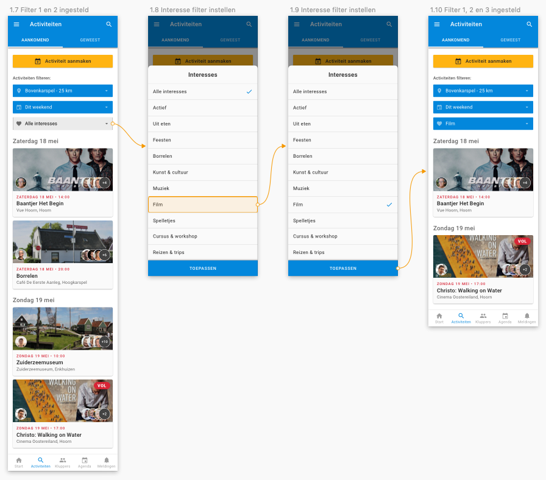
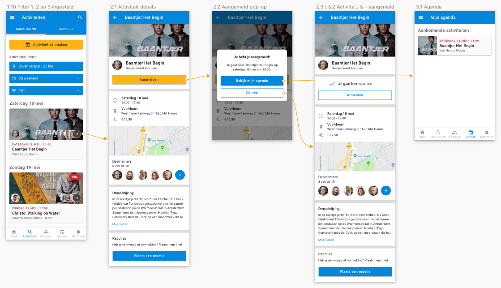

# Prototype 0.1

De activiteiten en de kluppers zijn de belangrijkste onderdelen in de app. In mijn eerste prototype heb ik daarom de volgende drie flows uitgewerkt:

1. Het vinden van activiteiten \(door middel van filtering\)
2. Het aanmelden voor een activiteit
3. Het vinden van andere kluppers \(door middel van filtering\)

Hieronder laat ik de verschillende onderdelen van mijn ontwerp zien. Om het verschil met de huidige app te bekijken kun je op het rechter tabblad klikken.

Ik heb dit prototype getest met twee personen die Klup nog niet kennen. Dit heb ik bewust gedaan om te kijken of de navigatie en informatie duidelijk is voor nieuwe gebruikers.

## 1. Intro & Startscherm



Wanneer de gebruiker de app op zijn telefoon heeft geïnstalleerd, krijgt hij eerst een korte introductie te zien waarin wordt uitgelegd wat Klup is. Dit doe ik door middel van een [intro tour](http://ui-patterns.com/patterns/Tour). Vervolgens komt hij op het startscherm terecht. Op dit scherm worden activiteiten in de buurt getoond, activiteiten die het laatst zijn toegevoegd en kluppers in de buurt.

Bovenaan heb ik een gele button gezet met de tekst "Ik wil graag...". Als je hier op klikt, krijg je een aantal acties te zien die op deze manier makkelijk bereikbaar en terug te vinden zijn. Hiervoor heb ik me laten inspireren door de [Stitch app](https://drive.google.com/file/d/1b4OmdRr2QwomLchwRL1Mkfc5tGXgtlhh/view?usp=sharing) \(een buitenlandse social app voor 50 plussers, vergelijkbaar met de Klup app\).




In de huidige app kun je een introductie video bekijken waarin Jaap \(community manager\) je welkom heet. Hij legt hij uit wie hij is en wenst je veel plezier bij de Klup activiteiten. Verder wordt er niet uitgelegd wat Klup is. In de [focus group](../../onderzoek-en-inzichten/de-kluppers/focus-group.md) komt naar voren dat hier wel behoefte aan is. 



Het startscherm van de huidige app is het ontdek scherm. Dit scherm bevat veel verschillende soorten content waardoor het erg druk is. De problemen die bij dit scherm naar voren komen kun je zien in mijn [analyse van de huidige app](../../verkenning/de-app/start-scherm.md).




## 2. Filteren



Bovenaan het overzicht met activiteiten heb ik drie dropdown menu's gezet voor het filteren op locatie, datum en interesses. Zo weet de gebruiker meteen welke filtermogelijkheden er zijn.

Wanneer de gebruiker op een filter klikt, verschijnt er een slidover. Ik heb hiervoor gekozen omdat je daarmee de context behoud met de getoonde resultaten \(zie [slideover VS full screen filtering](../../onderzoek-en-inzichten/content-filteren.md#slideover-vs-full-screen)\).

Wanneer de gebruiker een filter heeft ingesteld, wordt de dropdown balk blauw van kleur om extra duidelijk te maken dat die filter aan staat.

Wanneer de gebruiker op de datum filter klikt kan hij kiezen uit de opties: aankomend, laatst toegevoegd, morgen, dit weekend, volgende week of zelf een datum selecteren. [Meetup](https://ninavdberg92.gitbook.io/klup-redesign-productbiografie/onderzoek-en-inzichten/filteren-and-sorteren/best-good-and-bad-practices#meetup) gebruikt een soortgelijk filter voor de datum. Het leek me handig om die opties meteen bereikbaar te maken in plaats van altijd zelf een datum te moeten selecteren.




In de huidige app kun je de activiteiten filteren door rechtsboven op "filter" te klikken. Je krijgt dan meteen alle filter opties in beeld in een full screen. Hierdoor krijgt de gebruiker meteen heel veel informatie binnen waardoor hij eerder dingen over het hoofd ziet en niet goed weet wat hij moet doen. Na het instellen zie je in het overzicht niet welke filters er aan staan. 




## 3. Aanmelden voor een activiteit



Wanneer je op een activiteit klikt, komt je op de detail pagina van de activiteit terecht. Hier kun je je aanmelden voor de activiteit. Nadat je op 'Aanmelden' hebt geklikt, verschijnt er een pop-up met een bevestiging dat je je hebt aangemeld. Deze pop-up kun je sluiten, of je kunt klikken op 'Bekijk mijn agenda' om naar je agenda te gaan. Op de detailpagina zie je dat je je hebt aangemeld voor de activiteit en er is nu een knop om je af te melden.

Het grootste verschil vergeleken met de huidige app is dat mijn design een stuk rustiger en overzichtelijker eruit ziet, de flow is verder hetzelfde.








## 4. Kluppers



De gebruiker kan via de navigatie onderin naar het klupper scherm toe gaan. Dit scherm heb ik onderverdeeld in twee tabbladen: 'contacten' en 'alle'. In de huidige app vallen je contacten onder de inbox \(waar ook de meldingen en binnenkomen\), maar omdat het om de kluppers gaat leek me dit een logischere plek.   
  
In het eerste tabblad zie je je contacten waarmee je kunt chatten. Wanneer je nog geen contacten hebt zie je de onderstaande empty state. In het klupper overzicht kun je op dezelfde manier als bij activiteiten de getoonde resultaten filteren. Je kunt de kluppers filteren op locatie en op interesses. Geslacht en leeftijd heb ik weggelaten omdat dat naar mijn idee dating gerelateerde verzoeken in de hand werkt en verder niet veel meerwaarde heeft wanneer je zoekt naar een klupper om samen naar een activiteit te gaan \(dit is nog een aanname\).




In de huidige app kun je de klupper profielen alleen bereiken vanuit het ontdek scherm. Wanneer je voor het eerst klikt op "bekijk alle kluppers", krijg je de filter instellingen te zien. Daarna kun je door de profielen heen swipen. Dit vergt veel tijd omdat je één voor één de profielen moet bekijken.  
  
Wanneer je weer teruggaat naar het ontdek scherm en daarna nog een keer op "bekijk alle klupers" klikt, ga je meteen door naar de profielen. Pas wanneer je een keer bent uitgelogd en daarna weer inlogt, krijg je wel eerst de filters te zien. Hierdoor vergeet de gebruiker welke filters er ingesteld staan. Je kunt de filters aanpassen door op het zoekicoontje rechtsbovenin te klikken maar dit zie je snel over het hoofd. Daarbij geeft het de impressie dat je op die manier in iemands profiel kan zoeken omdat daar het zoekicoontje staat.





