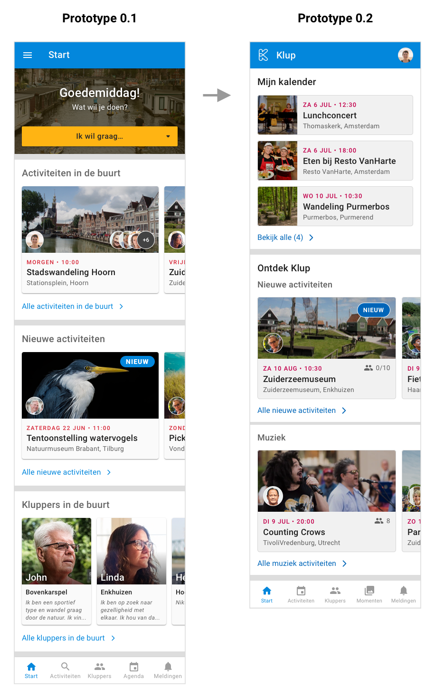

# Prototype 0.2

Bij mijn tweede prototype heb ik mijn eerste prototype aangepast qua design en lay-out, en ik heb het prototype uitgebreid met momenten, activiteit aanmaken, meldingen en klupper profiel details.

## **Aanpassingen t.o.v. vorige prototype**

### Bottom navigaton

In de navigatie onderaan heb ik 'agenda' vervangen door 'momenten'. De persoonlijke agenda is nu te bekijken op het startscherm. De momenten zaten eerst weggestopt bij activiteiten in het tweede tabblad, maar daar hoorde het eigenlijk niet thuis. Aangezien de momenten een belangrijk onderdeel uitmaken van de Klup app heb ik dit in de hoofdnavigatie geplaatst.

### Tabbladen

Ik heb het design van de tabbladen aangepast zodat er meer visueel onderscheid is tussen de header en tussen het actieve en inactieve tabblad. Ik wil testen of de tabbladen nu niet over het hoofd worden gezien door de gebruikers.

### Activity card design

Om de lay-out van de activity cards wat rustiger te maken, heb ik de foto's van de deelnemers rechts weggehaald. In plaats daarvan staat er nu rechts onder de foto het aantal deelnemers in cijfers. Zo zie je ook meteen hoeveel plekken er nog vrij zijn en wat het max aantal deelnemers is \(bijv. 3/6\).

### Startscherm

Het startscherm heb ik gepersonaliseerder en relevanter gemaakt door daar eerst de activiteiten te laten zien waarvoor je je hebt aangemeld. Daaronder zie je nieuwe activiteiten en activiteiten die passen bij je interesses \(bijvoorbeeld muziek\).

### Activiteiten filteren

Bij het vorige prototype had ik de filteropties meteen in beeld gezet in de vorm van dropdown menu's. Omdat dit veel ruimte in beslag neemt en het scherm drukker maakt dan nodig \(meteen drie opties in beeld, ook wanneer je niet wilt filteren\), heb ik bij het nieuwe ontwerp de filteropties onder een knop 'filter' geplaatst. Wanneer je daar op klikt, verschijnt er een side sheet met de filteropties.

### Toevoegingen

In het vorige prototype had ik nog niet alle onderdelen van de app uitgewerkt. Het nieuwe prototype heb ik uitgebreid met o.a. klupper profielen, momenten, activiteit aanmaken en meldingen.

## Prototype



## 1. Startscherm

Op het startscherm vind je je eigen kalender en staat er content die afgestemd is op de gebruiker, zoals bijvoorbeeld muziek activiteiten als je van muziek houdt. Als je op 'bekijk alle' klikt onder mijn kalender, zie je al je aankomende actvitieiten en kun je ook de activiteiten bekijken waar je al heen bent geweest.

Als je op 'bekijk alle' klikt onder één van de rijen activiteiten, ga je naar het activiteiten overzicht en zijn de filter- en sorteeropties ingesteld op hetgene waar je op hebt geklikt. Dus bij nieuwe activiteiten is de sortering ingesteld op 'laatst toegevoegd', en bij muziek activiteiten is het interesse filter ingesteld op 'muziek'.

De actieve filters staan bovenaan de activiteiten in blauwe tags. Zo weet je altijd welke filters er staan ingesteld.

## 2. Activiteiten overzicht

In het activiteiten overzicht kan de gebruiker rechtsboven op het zoek icoontje klikken om activiteiten te zoeken. Daaronder staan twee buttons, één voor het aanmaken van een activiteit en één voor het filteren van de activiteiten. Ook kun je de activiteiten sorteren op aankomende activiteiten en laatst toegevoegde activiteiten.

## 3. Activiteiten filteren

Wanneer de gebruiker op de filter button klikt, verschijnt er een side sheet waarin de filteropties staan. Ik heb me hierbij laten inspireren door de [Marktplaats](../../onderzoek-en-inzichten/content-filteren.md#marktplaats) app. Het gebruik van progressive disclosure hierbij helpt om alles overzichtelijk te houden en information overload tegen te gaan.

Ik heb t.o.v. het vorige prototype een filteroptie toegevoegd, namelijk het aantal deelnemers. Veel kluppers geven aan dat ze alleen naar activiteiten gaan met kleine groepen, dus daarom is het handig om dit erbij te hebben als filteroptie.

## 4. Activiteit aanmaken

De gebruiker kan een activiteit in de app toevoegen door in het activiteiten overzicht op 'Maak aan' te klikken. Vervolgens kan de gebruiker alle gegevens invullen die nodig zijn voor de activiteit. De gebruiker kan meteen typen in de vakken, hij hoeft dus niet zoals in de huidige app de titel, omschrijving en aantal deelnemers in een apart venster in te vullen en op opslaan te klikken \(zie [Flow activiteit toevoegen](../../verkenning/user-flows/activiteit-toevoegen.md)\).

## 5. Kluppers

Het klupper scherm is onderverdeeld in twee tabbladen: 'contacten en 'alle kluppers'. In het eerste tabblad zie je je contacten waarmee je kunt chatten. In het tweede tabblad zie je een overzicht van alle kluppers waarbij je net als bij de activiteiten kunt zoeken, filteren en sorteren.

Wanneer je op een klupper klikt ga je naar zijn of haar profiel. Hier kun je lezen waar de klupper woont, hoe lang hij al lid is en hoeveel activiteiten diegene heeft georganiseerd / deelgenomen. Ook zie je zijn interesses en de activiteiten waar deze persoon naar toe is geweest.

Je kunt een andere klupper uitnodigen voor een activiteit waar je zelf heen gaat door op 'nodig uit' te klikken. Als je contact met een klupper wil, kun je klikken op 'stuur bericht'. \(dit moet ik nog uitwerken\)

## Momenten

De momenten in de huidige Klup app deden me qua inhoud erg denken aan posts op [Facebook](https://drive.google.com/file/d/1HZGPfwyV-qiKF5LdNQ1kpdy4F8PbmQbj/view?usp=sharing). Daarom heb ik dat als voorbeeld gebruikt voor het design. Je ziet in het overzicht meteen bij welke activiteit het moment hoort, wanneer het was en welk bericht erbij is geschreven. Wanneer je op een foto klikt kun je door de foto's heen swipen.

