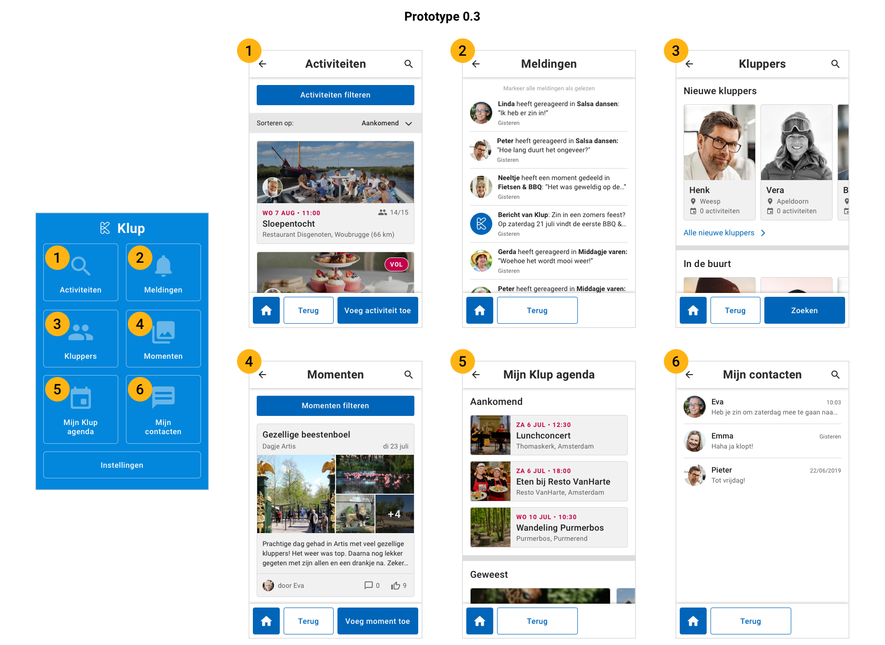

# Prototype 0.3

## Nieuwe navigatie

De grootste verandering vergeleken met het vorige prototype is de navigatie. In mijn vorige prototype gebruikte ik de bekende bottom navigation. Omdat uit mijn vorige testresultaten en eerdere observaties tijdens interviews is gebleken dat deze vorm van navigatie niet goed werkt voor de doelgroep, heb ik voor een andere aanpak gekozen.

In mijn nieuwe prototype heb ik voor een startscherm met grote knoppen gekozen. Vanuit hier kan de gebruiker naar de verschillende onderdelen van de app. Wanneer de gebruiker aan het navigeren is, kan hij altijd een stap terug door onderin op de terug knop te klikken. Ook kan hij altijd met één klik terug naar het startscherm door op de home knop te klikken. Ik heb voor deze vorm van navigatie gekozen omdat dit volgens [mijn onderzoek](../../onderzoek-en-inzichten/een-applicatie-voor-50-plussers.md#simpele-and-consisitente-navigatie) goed werkt voor een oudere doelgroep.

Ik heb de onderstaande flows uitgewerkt in mijn prototype:

## 1. Intro



## 2. Activiteiten filteren



## 3. Aanmelden voor activiteit



## 4. Filters wissen



## 5. Activiteiten sorteren



## 6. Kluppers zoeken



## 7. Bericht sturen naar klupper



## 8. Momenten bekijken en liken



## 9. Afmelden voor een activiteit



