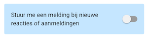
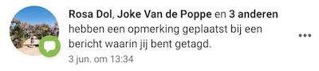
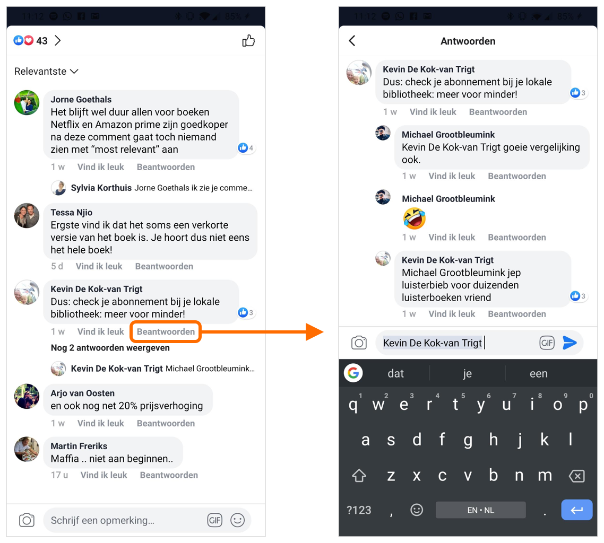

# Feedback van opdrachtgevers

Op 1 augustus heb ik prototype 0.3 laten zien aan Michelle en Michiel. Ze waren te spreken over het design en de nieuwe navigatie. Ze hadden wel een aantal suggesties voor aanpassingen.

## Feedback van opdrachtgevers

* Het zoekicoontje bij activiteiten, momenten en kluppers vervangen door een zoekbalk, zodat de gebruikers het niet over het hoofd kunnen zien en begrijpen wat het is. 
* Wanneer je op “aanmelden” klikt bij een activiteit moet er eerst gevraagd worden om bevestiging \(“weet je zeker dat je je wilt aanmelden?”\). Dit is in de huidige app ook zo en zorgt ervoor dat de gebruikers zich niet per ongeluk aanmelden en dat ze zeker weten dat ze aangemeld zijn. 
* De deelnemers van een activiteit moeten meer naar boven geplaatst worden bij de activiteit details zodat deze eerder in beeld zijn. Dit is belangrijke informatie voor de gebruikers, ze willen weten wie er naar de activiteit toe gaan voordat ze zich aanmelden. De foto van de organisator moet ook groter zijn, nu is deze erg klein \(24x24 pixels\). 
* Omdat de gebruikers nu gek worden van de hoeveelheid meldingen over nieuwe reacties bij activiteiten, heb ik in mijn prototype ervoor gekozen dat wanneer je bent aangemeld, je geen meldingen hierover ontvangt tenzij je dit zelf aanzet:

Michiel kwam met het punt dat wanneer je zelf een reactie plaatst en iemand reageert op jouw bericht, dat je dan wel een melding zou moeten krijgen, ook als je de meldingen uit hebt staan. De reden dat gebruikers gek worden van alle meldingen, is omdat hun inbox ermee volloopt en ze het overzicht verliezen. Daarom stel ik voor om gebruik te maken van dezelfde aanpak als Facebook:

Dus in plaats van alle reacties als losse meldingen te laten zien, worden ze verzameld onder één melding. Ditzelfde geldt voor meldingen over nieuwe aanmeldingen bij de activiteit. De gebruikers houden wel de mogelijkheid om push notificaties uit te zetten.

Wanneer iemand specifiek op jouw bericht reageerd, moet dit wel als aparte melding worden weergegeven. Ook hierbij kan de methode van Facebook worden gehanteerd:

* Bij het klupper overzicht heb ik de keuze gemaakt om geen filteropties toe te voegen, maar om wel secties te laten zien met bijvoorbeeld “kluppers in de buurt” en “nieuwe kluppers”. Ik had dit gedaan met de gedachte dat filteren op specifieke eigenschappen zoals geslacht en leeftijd, dating gerelateerde berichten in de hand werkt \(en hier is Klup niet voor bedoeld\). Michiel en Michelle snapten mijn gedachtegang hierachter, maar willen toch liever wel die filteropties erin hebben. Er zijn namelijk ook veel gebruikers die op zoek zijn naar vriendschappen en daarbij willen filteren op geslacht en leeftijd. En de filters worden gebruikt bij het zoeken naar kluppers om uit te nodigen voor een activiteit. 
* In de huidige app kun je kluppers uitnodigen door in hun profiel op “nodig uit” te klikken. Dit heb ik weggelaten en in plaats daarvan ervoor gekozen dat je alleen via de activiteit kluppers kunt uitnodigen. Dit vonden Michelle en Michiel toch een beetje omslachtig, dus ik ga de knop ook weer plaatsen in het klupper profiel. 
* Het overzicht met momenten vonden ze nu een beetje druk worden door de grote moment cards met boven en onder de foto’s tekst. De tekst onder de foto’s ga ik vervangen met de titel van het moment en activiteit en de datum, zodat alleen onder de foto’s tekst staat en de cards minder ruimte innemen. 
* Michelle heeft via de Klup ambassadeurs te horen gekregen dat organisatoren graag meerdere kluppers tegelijk uit willen kunnen nodigen voor hun activiteit.

## Conclusies

De volgende aanpassingen ga ik doorvoeren in het prototype:

* Zoekicoon vervangen door zoekbalk
* Na klik op aanmelding activiteit een pop-up met bevestiging tonen
* Foto's van deelnemers meer naar boven en grotere foto organisator in de activiteit details
* De mogelijkheid om kluppers te kunnen filteren op leeftijd, geslacht, woonplaats en interesses
* De mogelijkheid om iemand uit te nodigen voor een activiteit vanuit zijn of haar profiel
* De tekst onder de foto's van de momenten cards vervangen door de titel van de activiteit en de datum

De volgende aanpassingen neem ik niet mee in mijn volgende prototype, maar voeg ik toe als **won't have** in mijn [Programma van Eisen](../../onderzoek-en-inzichten/programma-van-eisen.md) omdat ze te veel tijd kosten om nu door te voeren:

* Meldingen over nieuwe reacties en aanmeldingen bij een activiteit worden verzameld onder één melding \(bijv. "Henk, Piet, Rosa en 5 anderen hebben gereageerd op de activiteit salsadansen"\)
* De mogelijkheid om te kunnen reageren op een specifieke reactie waarbij degene waarop je reageerd hier een melding over krijgt \(bijv. "Piet heeft gereageerd op je reactie in de activiteit salsadansen"\)
* De mogelijkheid voor organisatoren om meerdere kluppers tegelijk uit te nodigen voor hun activiteit

