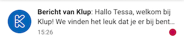
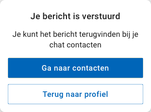

# Test niet-kluppers + resultaten

## Prototype



## Voorbereiding

Voor de test met niet-kluppers, heb ik mijn prototype zo in elkaar gezet zoals het eruit zou zien als je voor het eerst de Klup app gebruikt. Zo staan er bijvoorbeeld nog geen activiteiten in je agenda en heb je nog geen contacten.

Ik heb één "pad" uitgewerkt in het prototype, omdat ik anders in de knoop kwam met de schermen. De testpersoon krijgt namelijk als taak om zich aan- en af te melden voor een activiteit, en hij moet een bericht sturen naar een klupper. De schermen die je te zien krijgt hangen van deze contexten af. Daarom heb ik gekozen voor een vrij uitgebreide set aan scenario's die de testpersoon door dit pad heen leid. Ik heb er hierbij wel op gelet dat ik niet te veel hints geef in de bewoordingen, zodat de test wel valide blijft.

### Doel

Het belangrijkste doel bij deze test, is om erachter te komen of de nieuwe navigatie goed werkt. Daarom heb ik meerdere scenario's in mijn test zoals "Ga terug naar het startscherm" en "Ga terug naar de lijst met activiteiten" om te zien hoe de testpersonen hierbij gebruikmaken van de navigatie zoals ik het bedacht heb.

### Taken

1. Nieuwe melding bekijken
2. Een activiteit zoeken d.m.v. filtering
3. Aanmelden voor een activiteit
4. Filter instellingen wissen
5. Activiteiten sorteren op laatst toegevoegd
6. Een klupper profiel zoeken
7. Bericht sturen naar een klupper
8. Momenten bekijken en liken
9. Afmelden voor de activiteit

### Scenario's

1. Dit is de eerste keer dat je dit scherm ziet. Wat valt je op? Waar zou je als eerste op klikken?
2. Je wilt weten welke activiteiten er in de app staan. Bekijk de activiteiten.
3. Je bent aankomend weekend in Utrecht. Je wilt daar in de buurt aan een Klup activiteit deelnemen. Het lijkt je leuk om ergens wat te gaan drinken. Zoek een activiteit die je daar kunt doen.
4. Kies de activiteit voor zaterdagavond die nog niet volgeboekt is en meld je aan.
5. Je wilt weten wanneer iemand een berichtje plaatst in de activiteit.
6. Ga terug naar de lijst met activiteiten.
7. Je wilt alle activiteiten weer zien. Haal de filters die je hebt ingesteld weg.
8. Je wilt zien welke activiteiten er als laatste zijn toegevoegd.
9. Ga terug naar het startscherm.
10. Je vriendin Liesbeth uit Enkhuizen zit ook op Klup. Zoek het profiel op van Liesbeth.
11. Je wilt Liesbeth laten weten dat je nu ook aan het kluppen bent. Stuur haar een berichtje.
12. Bekijk het verstuurde bericht.
13. Ga naar de “momenten” in de app.
14. Bekijk het eerste moment.
15. Bekijk de foto’s die Eva bij het moment heeft geplaatst en geef het bericht een duimpje.
16. Je hebt je eerder aangemeld voor de activiteit “Hapjes & drankjes”. Er is iets tussengekomen, waardoor je niet meer naar de activiteit kunt. Meld je af.
17. Ga terug naar het startscherm.

## Testpersoon 1: Michel \(63 jaar\)

* Het eerste wat Michel opviel bij het startscherm, is het rode meldings-bolletje. Hier zou hij dan ook als eerste op klikken, omdat hij verwacht dat daar een bericht te lezen is. 
* Michel had bij de meldingen niet door dat hij op de melding kon klikken om het hele bericht te lezen. Dit kwam omdat de zin toevallig zo uitkwam alsof het leek alsof de tekst al af was. De drie puntjes aan het einde van de zin zag hij over het hoofd.

* In het scenario had ik gezet: “Je bent aankomende zaterdag en zondag in Utrecht. Je wilt daar een activiteit gaan doen.”. De testpersoon wilde het filter instellen op de plaats Utrecht, en vond het daarbij verwarrend dat hij ook nog een afstand in moest stellen \(“Ik wil alleen de activiteiten in de plaats Utrecht zien”\). 
* Het verschil tussen filteren en sorteren is niet duidelijk voor Michel, waardoor hij niet goed weet waar hij op moet klikken. Zijn verwachting was dat filteren is voor het soort activiteiten, en sorteren voor de datums \(dit klopt niet helemaal\). Zoals Cunha \(2017\) zegt in haar artikel op Medium:  _“In theory, they are different: sorting organises the content according to a certain parameter, filtering removes it from view. However, research suggests that for the user, the outcome is roughly equivalent: both surface the most relevant content according to their criteria. During user sessions, Baymard even reports some people to use “sorting” and “filtering” interchangeably.”_  Oftewel, voor de gebruiker is er vrijwel geen verschil tussen filteren en sorteren, zolang de juiste resultaten maar naar voren komen. 
* Na het wissen van de filters wist Michel niet goed wat hij moest doen. Na enige twijfel klikte hij toch maar op “voorkeuren opslaan”. 
* Nadat Michel een bericht had gestuurd aan klupper Liesbeth, vond hij het gek dat er in de pop-up stond “je kunt het bericht terugvinden bij je chat contacten”. Toen hij er even over nadacht vond hij het toch ook wel weer logisch. Hij zou hier wel klikken op “Terug naar profiel”, hij zou niet weten waarom hij nu naar z’n contacten zou willen gaan.

* Michel navigeerde heel makkelijk door de app heen. Hij had al snel door dat het huis icoontje hem terug bracht naar het startscherm, en dat de “terug” knop was om één scherm terug te gaan. Hij gaf aan dat hij deze navigatie prettig vind werken \(_“het is gewoon logisch”_\)

## Testpersoon 2: Didy \(58 jaar\)

* Het eerste wat Didy opviel bij het startscherm, is het rode meldings-bolletje. Hier zou ze dan ook als eerste op klikken, omdat ze verwacht dat daar een bericht te lezen is. 
* Didy vond het filtersysteem van de activiteiten niet zo prettig werken, ze vond het te veel handelingen. Zij zou eerder de zoekoptie gebruiken en daarin bijvoorbeeld typen: 'borrelen in utrecht'. 
* Didy zou het liefst zien dat ze eerst haar persoonlijke voorkeuren aan het begin opslaat, en dat de app dan automatisch activiteiten toont die haar interesse hebben zodat zij niet hoeft te zoeken. 
* Het woord 'filteren' snapte ze niet in deze context \(_“koffie filter je”_\), daardoor zou ze hier niet snel op klikken. 
* Bij het instellen van de locatie filter klikte ze in eerste instantie op de kaart i.p.v. op het invoerveld. Bij het instellen van de afstand klikte ze op de slider i.p.v. te vegen, omdat ze dit gewend was van andere apps. 
* Bij het weghalen van de filters miste ze het kruisje bij de ingestelde filters, dit is zij gewend van andere apps. Nadat ze klikte op “wis filters” in de slideover vond ze het verwarrend dat ze nog op “voorkeuren opslaan” moest klikken. 
* Ze vond de pop-up die verscheen na het sturen van een bericht naar een klupper verwarrend. Ze zou verwachten dat je meteen het gestuurde bericht in beeld ziet \(_“zoals bij Whatsapp”_\) 
* Toen ze de taak kreeg om zich af te melden voor de activiteit, twijfelde of ze dit kon doen bij “Meldingen” of “Mijn Klup agenda”. Nadat ik het verschil uit had gelegd vond ze het logisch, maar hier zou ze dan eerst uitleg over willen krijgen in de app. 
* Didy navigeerde net als de vorige testpersoon heel makkelijk door de app heen. Ook zij maakte gebruik van zowel de terug knop als de home knop.

## Testpersoon 3: Marjet \(54 jaar\)

* De kleine introductie vond Marjet leuk, het gaf haar het gevoel dat ze meteen zin had om te gaan kluppen. 
* Marjet klikte net als de twee vorige testpersonen meteen op de knop met het rode meldings-bolletje \(_"Dat is niet te missen!"_\) 
* Marjet zou voor het zoeken naar activiteiten op het zoekicoontje drukken. Ze wist niet wat "activiteiten filteren" inhield in deze context. 
* Marjet klikte bij het instellen van de locatie filter in eerste instantie op de kaart i.p.v. in het tekst invoerveld. Ze vond het handig dat ze na het instellen van de afstand op de kaart kon zien binnen welk gebied ze activiteiten zocht. 
* Voor het wissen van de filters wist Marjet niet zo goed waar ze dat kon doen. Eerst klikte ze op de ingestelde filter tags. Daarna klikte ze pas weer na even denken op de filter knop. Na het wissen wist ze niet zeker of de filters nou wel gewist waren. 
* Bij het scenario _je wilt zien welke activiteiten als laatste zijn toegevoegd_ klikte ze weer op de filter knop. Ze vond het verwarrend dat dat dan weer via het het overzicht moest. 
* Bij de pop-up na het versturen van een bericht wilde Marjet meteen op "Terug naar profiel" klikken. Ze zou niet op "Ga naar contacten klikken". Ze zou verwachten dat je meteen terug naar het profiel zou gaan of het verstuurde bericht zou zien. 
* Ook Marjet maakte meteen gebruik van de navigatie onderaan en gebruikte de home en terug knop met gemak.

## Conclusies & Inzichten

Het rode bolletje op het start scherm dat een nieuwe melding aangeeft valt op en dat is goed, want dat is precies de bedoeling.

Het filteren van de activiteiten gaat nog niet helemaal soepel. Twee van de drie testpersonen snapten het woord "filteren" niet. Het vergrootglas icoontje wordt daarentegen wel herkent als knop om te zoeken. De gebruikers moeten de filters ook weer makkelijk kunnen wissen. Het is voor hen niet vanzelfsprekend dat ze daarvoor eerst weer op de knop "activiteiten filteren" moeten klikken.

De pop-up die komt na het versturen van een bericht aan een klupper zorgt voor verwarring. Hiervan moet de tekst en/of opties aangepast worden, of de pop-up moet worden weggelaten.

Alledrie de testpersonen navigeerden makkelijk door het prototype heen door middel van de home en terug knoppen onderaan. Ze maakten hier meteen intuïtief gebruik van.

