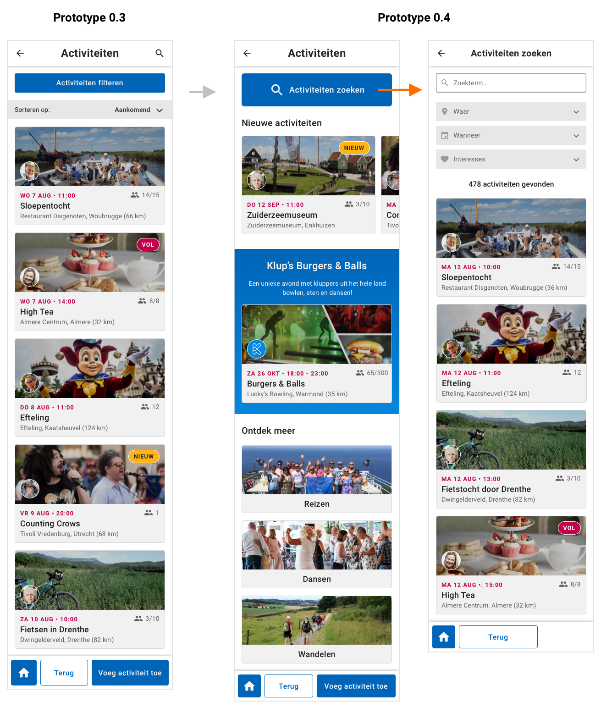
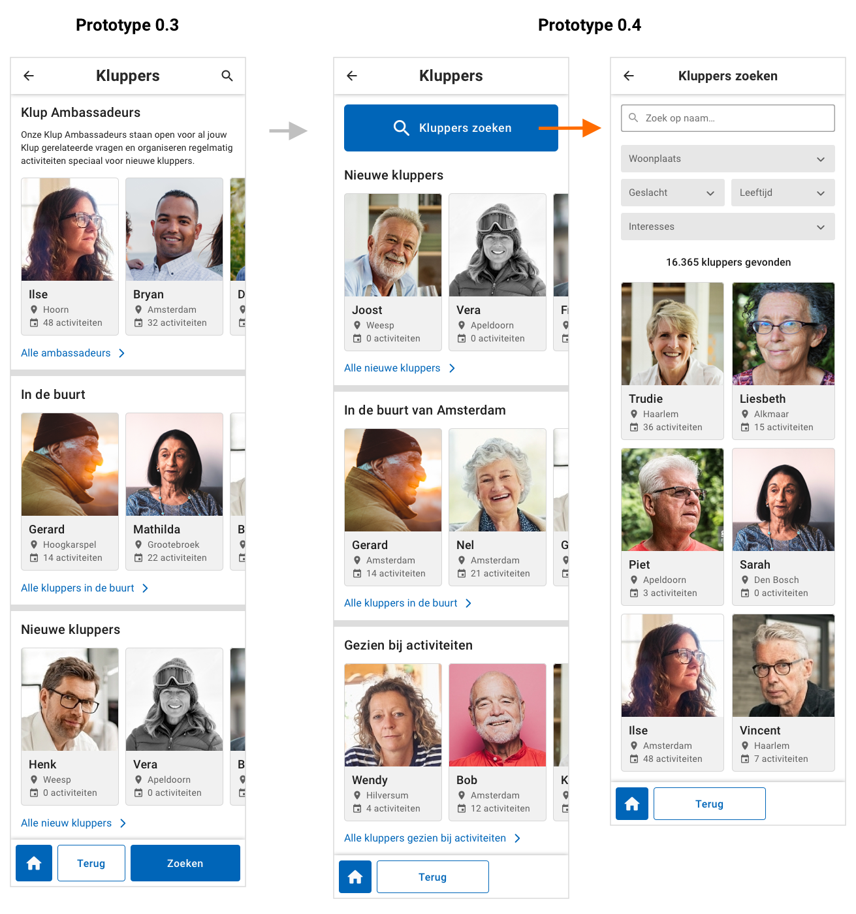
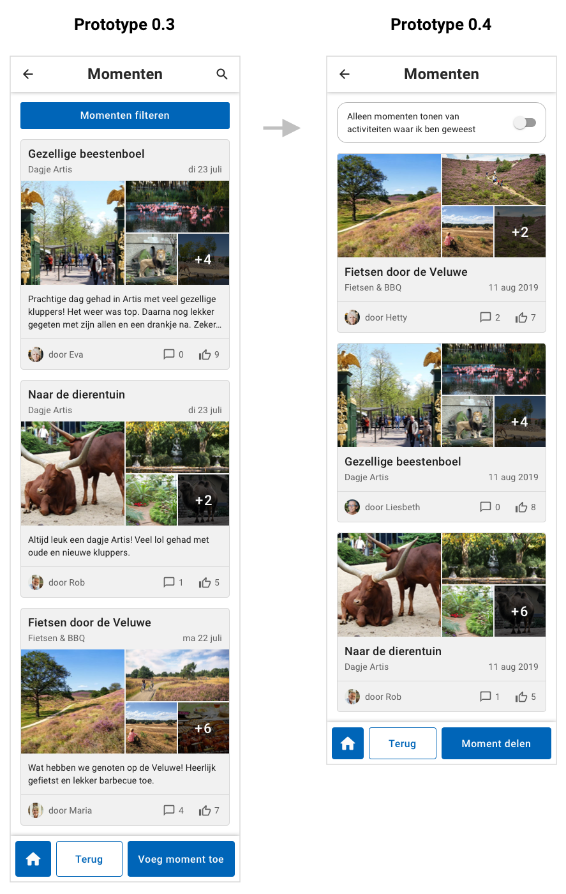

# Prototype 0.4

## Veranderingen t.o.v. vorige prototype

### Filteren

Uit de test van prototype 0.3 met [niet-kluppers](../prototype-0.3/test-niet-kluppers-+-resultaten.md) is gebleken dat het filteren niet helemaal soepel ging. Zo is de betekenis van het woord "filteren" in deze context vaak niet duidelijk, en ook niet hoe je de filters weer kunt wissen.

Bijkomend probleem met deze manier van filteren is dat de filter tags met ingestelde filters ervoor zorgen dat de interface best wel druk wordt, vooral wanneer je meerdere interesses hebt geselecteerd. 



In prototype 0.4 heb ik daarom voor een andere weergave van de filtering gekozen waarbij er bovenaan drie dropdown menu's staan met de filteropties. Ik ben hiermee weer teruggekomen op de manier die ik bij mijn [eerste prototype](../prototype-0.1/) had. Daar ben ik toen van afgestapt omdat dit meer schermruimte in beslag neemt ****dan alleen een filter knop, maar ik denk dat de voordelen van deze weergave daar tegenop wegen.

De voordelen hiervan zijn dat je meteen de filteropties in beeld hebt staan. Het woord "filteren" wordt hierbij niet gebruikt. Je zit al in het activiteiten zoeken scherm dus de context is daarbij duidelijk genoeg. Wanneer je een filter hebt ingesteld staat dit in de dropdownbalk. De actieve filter tags zijn hierdoor niet meer nodig wat ervoor zorgt dat de interface een stuk rustiger is.

Een soortgelijke manier van filteren zie je terug bij [NMLK, WelcomeApp en Stitch](../../onderzoek-en-inzichten/content-filteren.md#nmlk), die qua inhoud vergelijkbaar zijn met de Klup app \(zoeken naar activiteiten\).



### Activiteiten

Uit mijn [test met kluppers](../prototype-0.3/test-kluppers-+-resultaten.md) is gebleken dat gebruikers snel nieuwe activiteiten willen kunnen zien. Dit staat in de huidige app op het ontdek scherm. In mijn huidige herontwerp heb ik het ontdek scherm weggelaten en vervangen voor het startscherm. In prototype 0.4 heb ik daarom de nieuwe activiteiten toegevoegd aan het activiteiten scherm. Dit scherm fungeert nu als **ontdek scherm voor activiteiten**. Naast de nieuwe activiteiten kan Klup hier zelf een eigen activiteit uitlichten, zoals bijvoorbeeld Burgers & Balls \(het Klup najaarsfeest waar 300 kluppers naar toe kunnen\). Daaronder heb ik kaartjes gezet die leiden naar activiteiten van een bepaalde interesse. Dit is wellicht overbodig omdat de gebruiker hier zelf ook op kan filteren, maar aan de andere kant kan het handig zijn om met één klik alle activiteiten te kunnen zien van een bepaalde interesse.

Bovenaan heb ik een grote zoek knop gezet. Als de gebruiker daar op klikt komt bij bij het activiteiten overzicht uit en kan hij de activiteiten zoeken en filteren.

### Kluppers

Uit mijn [test met kluppers](../prototype-0.3/test-kluppers-+-resultaten.md) en [feedback van de opdrachtgevers](../prototype-0.3/feedback-van-opdrachtgevers.md) is gebleken dat de gebruikers kluppers willen kunnen filteren. Om de navigatie structuur consistent te houden heb ik ervoor gekozen om voor dezelfde aanpak te gaan als bij de activiteiten. Wanneer je vanuit het startscherm op "kluppers" klikt, kom je eerst op het **ontdekscherm voor kluppers** terecht. Daarboven staat een grote zoek knop. Wanneer je daar op klikt kom je bij het klupper overzicht uit en kun je kluppers zoeken en filteren.

Het rijtje met Klup ambassadeurs heb ik weggelaten, omdat de opdrachtgevers er nog niet over uit zijn of die zo prominent in de app moeten worden weergegeven.

### Momenten

Bij het momenten scherm heb ik het design van de kaartjes aangepast zoals [de opdrachtgevers](../prototype-0.3/feedback-van-opdrachtgevers.md) hebben voorgesteld. Daarnaast heb ik ervoor gekozen om de filter- en zoekopties bij dit scherm weg te laten. Wanneer de gebruiker hierbij kijkt, zijn er twee scenario's mogelijk: 1. De gebruiker heeft even niks te doen en vind het leuk om erdoor heen te scrollen en de foto's te bekijken. 2. De gebruiker is naar een activiteit geweest en wil kijken of andere deelnemers een moment hierover hebben geplaatst.

Om aan beide scenario's te voldoen, heb ik bovenaan een toggle geplaatst waarmee je de getoonde momenten kunt switchen tussen alle momenten, en alleen de momenten van activiteiten waar je zelf heen bent geweest.

## Prototype



