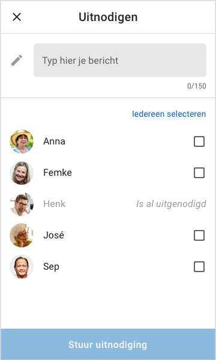

# Test + resultaten

## Prototype



## Voorbereiding

Voor de test met dit prototype heb ik een mail gestuurd naar 82 kluppers met de vraag of ze mijn prototype willen komen testen. Uiteindelijk heb ik hier maar twee responses op gehad van kluppers die dat willen en met hen heb ik een afspraak gemaakt. Daarnaast ga ik de test uitvoeren met Jaap, de community manager van Klup. Hij is zelf ook klupper.

### Doel

Ik wil testen of [de aanpassingen die ik heb doorgevoerd](./) sinds mijn vorige prototype goed worden ervaren door de kluppers. Het gaat hierbij om de werking van het filter systeem en de content op de activiteiten, klupper en momenten schermen. Daarnaast heb ik nu het uitnodigen van contacten voor een activiteit toegevoegd, dus ook dat neem ik mee in de test. Deze flow had ik nog niet uitgewerkt in mijn eerdere prototypes.

### Taken

1. Activiteiten filteren
2. Aanmelden voor een activiteit
3. Contactpersoon uitnodigen voor activiteit
4. Bericht sturen naar klupper
5. Melding bekijken
6. Activiteit uitnodiging accepteren
7. Momenten bekijken
8. Afmelden voor activiteit

### Scenario's

1. Ga naar de activiteiten. Wat vind je van dit overzicht?
2. Zoek een activiteit voor deze zaterdag in de buurt van Amsterdam. Je wilt alleen de activiteiten zien die aansluiten bij je eigen interesses.
3. Bekijk de bovenste activiteit en meld je aan.
4. Je wilt je Klup maatje Femke meenemen naar de activiteit. Nodig haar uit via de app.
5. Ga naar de klupper profielen. Wat vind je van dit overzicht?
6. Gisteren ben je met Klup gaan varen en je hebt toen een leuk gesprek gehad met Liesbeth. Je wilt haar een berichtje sturen.
7. Je hebt een nieuwe melding ontvangen. Bekijk de melding.
8. Accepteer de uitnodiging van Anna.
9. Je wilt momenten terugkijken van de activiteiten waar je bent geweest. Hoe zou je dat doen?
10. Vrijdag 30 augustus heb je een activiteit gepland staan, maar er is iets tussengekomen. Meld je af voor de activiteit.

## Testresultaten

### Testpersoon 1: Jaap \(66 jaar\)

Jaap is de **community manager bij Klup** en tevens zelf fanatiek klupper. Hij heeft al meer dan 300 \(ja, echt waar\) activiteiten bij Klup georganiseerd. 

* Jaap snapte door het design dat de activiteit van Klup uitgelicht was, maar hij zou dat er voor de duidelijkheid bij zetten. 
* De categorieën onderin het activiteitenscherm vond hij overbodig, omdat je zelf kan filteren op je interesses. 
* Bij het filteren van de datum vond hij de plattegrond met de afstand erop heel handig. 
* Jaap vond het fijn om de filter instellingen zo bovenaan in beeld te hebben \(_"Ik zie meteen waar ik op kan klikken en wat ik ingesteld heb"_\) 
* Bij het uitnodigen van een contact zag hij over het hoofd dat hij een bericht mee kon sturen. 
* Kluppers in de buurt vond Jaap overbodig \(_"Ik kan zelf wel zoeken als ik dat wil"_\) 
* Hij vond het niet duidelijk dat als je iemand een bericht stuurt, dat diegene dan meteen toegevoegd wordt aan je contacten. Dit moet er duidelijk bij staan of er moet verschil worden gemaakt tussen het toevoegen als een contact en alleen een bericht sturen. 
* Bij het momenten scherm vond hij de de toggle om alleen momenten te zien van activiteiten waar je zelf bent geweest een goede toevoeging. 
* Hij vond het gek dat je eigen momenten in je Klup agenda staan. Dat is ook niet nodig omdat je ze ook makkelijk in het momenten gedeelte terug kan vinden door de toggle aan te zetten. 
* Jaap was erg te spreken over het design en de manier van navigeren in de app. 

### Testpersoon 2: Margreet \(67 jaar\)

* Margreet vond het startscherm meteen mooi overzichtelijk. 
* Bij het uitnodigen van een contact zag ze over het hoofd dat ze een bericht mee kon sturen. 
* Margreet kijkt zelf eigenlijk nooit tussen de kluppers. Alleen wanneer ze iemand op een activiteit heeft ontmoet en daar meer contact mee wil voegt ze diegene toe. Ze stuurt geen uitnodigingen naar mensen die ze niet kent. 
* Margreet vond het niet duidelijk dat als je iemand een bericht stuurt, dat diegene dan meteen toegevoegd wordt aan je contacten. Dit moet er duidelijk bij staan of er moet verschil worden gemaakt tussen het toevoegen als een contact en alleen een bericht sturen. 
* Margreet noemde zelf op dat het handig zou zijn als je een melding zou krijgen wanneer iemand een moment toevoegt. 

### Testpersoon 3: Karin \(59 jaar\)

* Karin vond de kalender bij het filteren op datum makkelijk werken, omdat je snel kunt zien welke datum bij welke dag hoort. 
* Bij het uitnodigen van een contact zag ze over het hoofd dat ze een bericht mee kon sturen. 
* Karin zou de verstuurde uitnodiging graag terug willen kunnen zien zodat ze weet wat ze aan iemand gestuurd heeft en ze wil weten of de andere de uitnodiging accepteerd of niet. 
* Ze vond op het klupper scherm het meest interessant om kluppers in de buurt te zien, omdat ze ook altijd naar activiteiten in de buurt gaat. De andere rijtjes hoeven er van haar niet bij te zitten. 
* Karin kijkt in de huidige app wel eens bij momenten of er een moment is aangemaakt van een activiteit waar ze is geweest. En soms kijkt ze er zomaar tussen. De toevoeging van de toggle vind ze handig. 
* Karin geeft aan dat ze in de huidige app eigenlijk bijna nooit met iemand chat. Wanneer ze met iemand een klik heeft wisselt ze telefoonnummers uit en gebruikt ze WhatsApp om te chatten. Ze gebruikt haar contacten in de app wel om uit te kunnen nodigen voor activiteiten.

## Conclusies & Inzichten

De testpersonen hadden geen problemen met het nieuwe filter systeem. Het is ze meteen duidelijk wat de filters zijn en hoe ze deze aan kunnen passen.

Bij het sturen van de uitnodiging had ik het typen van een bericht en het selecteren van je contacten op één scherm neergezet. De testpersonen drukten alledrie na het selecteren van het contact meteen op "Stuur uitnodiging". Dat je daarboven nog een bericht kon typen zagen ze over het hoofd. Dit heeft waarschijnlijk deels te maken met de werking van de huidige app. In de huidige app moet je eerst je contacten selecteren en daarna pas \(eventueel\) een bericht typen.

In mijn volgende prototype wil ik deze twee stappen daarom weer uit elkaar trekken. Dit past ook meer bij de stap-voor-stap aanpak die goed werkt voor deze doelgroep.

Het is voor de gebruikers niet duidelijk en niet logisch dat wanneer je een bericht stuurt aan een klupper, dat diegene dan automatisch toegevoegd wordt aan je contacten. Nu ik er zo over nadenk is dat ook wel een beetje vreemd. Ik wil de optie om een bericht te sturen zonder dat je contact bent van elkaar er wel inhouden, omdat het praktisch is om even snel een bericht aan iemand te kunnen sturen als je bijvoorbeeld elkaar zoekt op een activiteit of met iemand mee wilt reizen. Hierdoor ga je ook tegen dat de reacties bij de activiteiten vollopen met dit soort berichten.

Daarnaast wil ik de optie geven om iemand aan je contacten toe te voegen. Zoals testpersoon Karin opnoemde, heeft ze haar contacten voornamelijk om uit te kunnen nodigen voor een activiteit. Chatten doet ze liever via WhatsApp. Dit heb ik vaker gehoord van kluppers die ik heb gesproken. Het zou dus onhandig zijn om elke klupper waarmee je gechat hebt in je contactenlijst te hebben staan. Daarom ga ik onderscheid maken tussen alleen een bericht sturen en toevoegen als contact.

