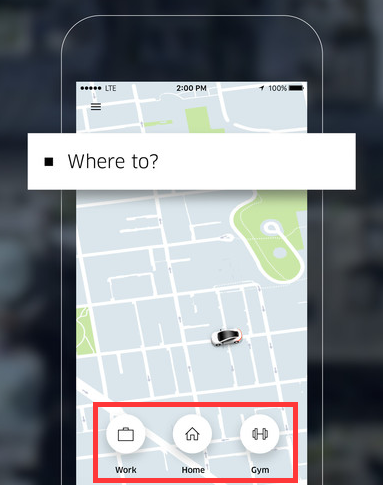

# Content filteren

Om gerichter te kunnen zoeken naar activiteiten, is het belangrijk dat de gebruikers de activiteiten makkelijk kunnen filteren. Ik heb deskresearch gedaan naar de verschillende opties die hiervoor mogelijk zijn.

**Toegepaste filters moeten altijd zichtbaar zijn**  
Om er voor te zorgen dat gebruikers ten alle tijden weten welke filters er aan staan, is het verstandig om de toegepaste filters te laten zien op de plaats waar je ze hebt ingesteld, en bovenaan het overzicht met de resultaten.

**Spreek de taal van de gebruiker**  
De filters die je in kunt stellen, moeten passen bij het taalgebruik van de gebruikers. Wanneer je bijvoorbeeld op een kleding webshop op zoek bent naar jurkjes, is "nauwaansluitend" als filter een betere benaming dan "bodycon". 

**Verschil tussen filteren en sorteren**  
In theorie zijn filteren en sorteren twee verschillende dingen: door te filteren verklein je het aantal getoonde resultaten, en met sorteren verander je de volgorde van de getoonde resultaten. In de praktijk is het echter zo dat gebruikers deze twee termen door elkaar gebruiken. De uitkomst is voor de gebruiker hetzelfde, namelijk de meest relevante content naar voren brengen.

Sorteren is alleen logisch voor filters van hetzelfde "type". Bijvoorbeeld voor het sorteren van broeken op prijs van laag naar hoog. Filteren past beter bij filters die elkaar uitsluiten. Wanneer je naar een broek zoekt, is het logisch om te filteren op "strakke broek", en niet om te sorteren op fitting van strak naar wijd.

**Voorselectie tijdens onboarding**  
Het kan nuttig zijn om in plaats van filteropties aan te bieden elke keer als de gebruiker iets zoekt op je app of website, om gebruikers tijdens de onboarding te laten kiezen wat voor content ze willen zien. Medium doet dit bijvoorbeeld door de gebruikers eerst te laten kiezen welke onderwerpen ze interessant vinden. Dit is voor Medium een gepaste keuze, omdat het niet vanzelfsprekend is dat je interessegebieden erg veranderen elke keer als je de website opent.

Voor Klup zal dit op dit moment geen handige keuze zijn, [omdat de interesses waaruit de gebruiker kan kiezen niet altijd goed aansluiten bij de activiteiten](de-kluppers/interviews.md#resultaten). Daarnaast is de hoeveelheid activiteiten die wordt aangeboden niet zo groot dat het moeilijk doorzoekbaar is \(gemiddeld ruim 100 activiteiten per week die plaatsvinden door het hele land\). Ik heb nagedacht over de optie om van te voren aan te geven binnen welke afstand je activiteiten wilt zien, maar ook dat is niet handig met het aantal activiteiten dat nu wordt aangeboden. Er zijn namelijk gebieden waar vrijwel geen activiteiten plaatsvinden. De gebruiker kan dan beter zelf de filters instellen en zien hoeveel resultaten het oplevert.

**Maak meestgebruikte filteropties snel toegankelijk**  
Door veelgebruikte filters direct bereikbaar te maken, bespaar je de gebruiker tijd en moeite. Uber heeft bijvoorbeeld de meest gebruikte bestemmingen \(work, home en gym\) van de gebruiker meteen in beeld gezet als snelkoppelingen.

Klup zou dit kunnen toepassen door bijvoorbeeld snelkoppelingen toe te voegen voor de activiteiten die aansluiten bij de interesses van de gebruiker.

**Verschillende weergaven voor mentale filtering**  
Bij bepaalde filters kan het nuttig zijn om een ander soort weergave te laten zien. Wanneer je bijvoorbeeld op Google Maps zoekt naar een café, en je belangrijkste eis is dat het cafeé dicht in de buurt is, is het praktisch om de getoonde café's op een plattegrond te laten zien. Wanneer je keuze ook afhangt van andere factoren, zoals waardering of prijs, is het handiger om de resultaten in een lijst te bekijken.

Aangezien de Klup activiteiten plaatsvinden door het hele land, maar de verspreiding hiervan niet erg gelijkmatig is, kan een plattegrond weergave een handige toevoeging kunnen zijn om snel te kunnen zien welke activiteiten er het dichtst bij je in de buurt zitten.

Cunha, 2017.

## Slideover VS full screen

Thierry Meier \(2015\) legt het verschil uit tussen slideover filtering en full screen filtering.

**Slideover** filtering werkt het beste wanneer de app niet zoveel filteropties heeft en wanneer je de context wilt behouden met de getoonde resultaten. Veel applicaties gebruiken deze methode.

**Full screen** filtering is het handigst wanneer er veel data is om te filteren, zodat je meer ruimte van het scherm hebt om te gebruiken. Het zorgt daarnaast voor een meer gefocusde ervaring.

Bij Klup zou een **slideover** filter het beste passen, omdat er niet zoveel filtertopties zijn en het voor de gebruikers duidelijker maakt wat ze aan het filteren zijn.

## Best, good and bad practices

Om inspiratie op te doen en te zien hoe filters in andere apps werken, heb ik voorbeelden verzameld van filter systemen in andere apps. Ik heb hierbij gekeken naar zowel soorgelijke apps als de Klup app, alswel andere apps die filteropties aanbieden. Onder elke app heb ik de plus- en minpunten gezet die betrekking hebben tot de app.

### NMLK

<table>
  <thead>
    <tr>
      <th style="text-align:left">&#x1F44D; Pluspunten</th>
      <th style="text-align:left">&#x1F44E; Minpunten</th>
    </tr>
  </thead>
  <tbody>
    <tr>
      <td style="text-align:left">
        <ul>
          <li>Wanneer je op het filtericoon hebt geklikt, worden de filteropties duidelijk
            weergegeven in de vorm van dropdown menu&apos;s en invoervelden</li>
        </ul>
      </td>
      <td style="text-align:left">
        <ul>
          <li>Om de filteropties te openen moet je klikken op een klein filtericoon,
            dit is voor mijn doelgroep waarschijnlijk niet duidelijk (en ik zag het
            zelf ook bijna over het hoofd)</li>
          <li>Ik zie in het overzicht niet goed welke filters ik heb ingesteld. Het
            staat er wel maar hier lees je snel overheen en de zin wordt afgekapt.</li>
          <li>Ik kan maar &#xE9;&#xE9;n categorie tegelijk kiezen om op te filteren</li>
        </ul>
      </td>
    </tr>
  </tbody>
</table>### WelcomeApp

<table>
  <thead>
    <tr>
      <th style="text-align:left">&#x1F44D; Pluspunten</th>
      <th style="text-align:left">&#x1F44E; Minpunten</th>
    </tr>
  </thead>
  <tbody>
    <tr>
      <td style="text-align:left">
        <ul>
          <li>De filters staan meteen duidelijk in beeld in de vorm van dropdown menu&apos;s</li>
          <li>Je ziet altijd welke filters je hebt ingesteld</li>
          <li>Met &#xE9;&#xE9;n klik kun je filteren op &quot;bij mij in de buurt&quot;</li>
        </ul>
      </td>
      <td style="text-align:left">
        <ul>
          <li>Bij het filter voor de locatie staan een pinpoint icoon en de tekst &quot;geen
            voorkeur&quot;, waardoor het niet heel duidelijk is dat het om de locatie
            gaat.</li>
          <li>Deze weergave is alleen mogelijk bij weinig filteropties, anders neemt
            het te veel ruimte van het scherm in beslag</li>
          <li>&apos;bij mij in de buurt&apos; is niet voor iedereen hetzelfde. Wat de
            &#xE9;&#xE9;n in de buurt vind, vind de ander te ver weg</li>
        </ul>
      </td>
    </tr>
  </tbody>
</table>### Stitch

<table>
  <thead>
    <tr>
      <th style="text-align:left">&#x1F44D; Pluspunten</th>
      <th style="text-align:left">&#x1F44E; Minpunten</th>
    </tr>
  </thead>
  <tbody>
    <tr>
      <td style="text-align:left">
        <ul>
          <li>De filter instellingen die aan staan, worden weergegeven in de vorm van
            een zin met grote tekst, dit is heel duidelijk</li>
          <li>De locatie staat standaard ingesteld op de plaats die je in je profiel
            hebt aangegeven als woonplaats</li>
        </ul>
      </td>
      <td style="text-align:left">
        <ul>
          <li>De afstand is standaard ingesteld op &quot;closest&quot;. Dit staat er
            niet bij in de zin, en ik zie in de resultaten geen activiteiten voor Amsterdam</li>
          <li>Ik kan niet filteren op type activiteiten, alleen op &quot;all&quot;,
            &quot;past&quot; en &quot;activities in my groups&quot; (ik snap dat groepen
            systeem niet)</li>
        </ul>
      </td>
    </tr>
  </tbody>
</table>### Meetup

<table>
  <thead>
    <tr>
      <th style="text-align:left">&#x1F44D; Pluspunten</th>
      <th style="text-align:left">&#x1F44E; Minpunten</th>
    </tr>
  </thead>
  <tbody>
    <tr>
      <td style="text-align:left">
        

        <ul>
          <li>Je ziet in het overzicht welke filteropties je aan hebt staan</li>
          <li>Bij filteren op datum is het handig dat de specifieke datums erbij staan
            (bijv. volgende week 15-21 jul.)</li>
        </ul>
      </td>
      <td style="text-align:left">
        <ul>
          <li>Geen idee wat &quot;Afstand beperken - Beste match&quot; betekend (laatste
            filteroptie)</li>
          <li>Ik kan niet filteren op type evenementen</li>
        </ul>
      </td>
    </tr>
  </tbody>
</table>### AH

<table>
  <thead>
    <tr>
      <th style="text-align:left">&#x1F44D; Pluspunten</th>
      <th style="text-align:left">&#x1F44E; Minpunten</th>
    </tr>
  </thead>
  <tbody>
    <tr>
      <td style="text-align:left">
        <ul>
          <li>Je ziet in de groene knop en achter een filter setting hoeveel resultaten
            er over blijven</li>
          <li>Door de blauwe kleur tekst zie je snel welke filters je hebt ingesteld</li>
        </ul>
      </td>
      <td style="text-align:left">
        <ul>
          <li>Erg veel opties tegelijk in beeld</li>
          <li>In het overzicht zie je niet welke filters je hebt ingesteld</li>
        </ul>
      </td>
    </tr>
  </tbody>
</table>### Marktplaats

<table>
  <thead>
    <tr>
      <th style="text-align:left">&#x1F44D; Pluspunten</th>
      <th style="text-align:left">&#x1F44E; Minpunten</th>
    </tr>
  </thead>
  <tbody>
    <tr>
      <td style="text-align:left">
        <ul>
          <li>Je ziet in de blauwe knop hoeveel resultaten er overblijven na het instellen
            van een filter</li>
          <li>Door de slideover view zie je meteen wat er gebeurd, want na het instellen
            van een filter zie je dat de content in de achtergrond refresht</li>
        </ul>
      </td>
      <td style="text-align:left">
        <ul>
          <li>De complete lay-out is behoorlijk druk, met de instellingen bovenin en
            de instellingen in de slideover sheet.</li>
        </ul>
      </td>
    </tr>
  </tbody>
</table>### Hema

<table>
  <thead>
    <tr>
      <th style="text-align:left">&#x1F44D; Pluspunten</th>
      <th style="text-align:left">&#x1F44E; Minpunten</th>
    </tr>
  </thead>
  <tbody>
    <tr>
      <td style="text-align:left">
        <ul>
          <li>Je ziet in de knop onderaan hoeveel resultaten er overblijven na het instellen
            van een filter</li>
        </ul>
      </td>
      <td style="text-align:left">
        <ul>
          <li>In het overzicht zie je niet welke filters je hebt ingesteld</li>
          <li>De knopjes bovenaan zijn erg klein</li>
          <li>Raar systeem met de dropdowns in het side filter</li>
        </ul>
      </td>
    </tr>
  </tbody>
</table>### H&M

<table>
  <thead>
    <tr>
      <th style="text-align:left">&#x1F44D; Pluspunten</th>
      <th style="text-align:left">&#x1F44E; Minpunten</th>
    </tr>
  </thead>
  <tbody>
    <tr>
      <td style="text-align:left">
        <ul>
          <li>Je ziet in het overzicht welke filters er aan staan door de tags</li>
          <li>Er staat duidelijk &quot;Filteren en sorteren&quot; met een icoontje erbij</li>
          <li>Je ziet in de knop onderaan en achter een filter setting hoeveel resultaten
            er overblijven</li>
        </ul>
      </td>
      <td style="text-align:left">
        <ul>
          <li>Door de afstand tussen de labels links en de instelling rechts en het
            gebrek aan dividers zie je niet zo makkelijk wat je hebt ingesteld.</li>
        </ul>
      </td>
    </tr>
  </tbody>
</table>## Toevoegingen aan PvE

De volgende eisen komen voort uit dit onderzoek en neem ik mee in mijn [programma van eisen](programma-van-eisen.md).


**De toegepaste filters moeten zichtbaar zijn in het overzicht met gefilterde resultaten en op de plaats waar de gebruiker ze heeft ingesteld**



**De filteropties moeten aansluiten bij het taalgebruik van de gebruiker**



**De meestgebruikte filteropties moeten snel toegankelijk worden gemaakt**



**De activiteiten die in de app staan moeten kunnen worden weergegeven op een plattegrond**



**Je moet in het activiteiten overzicht kunnen zien hoeveel resultaten er getoond worden na het filteren**


\*\*\*\*

