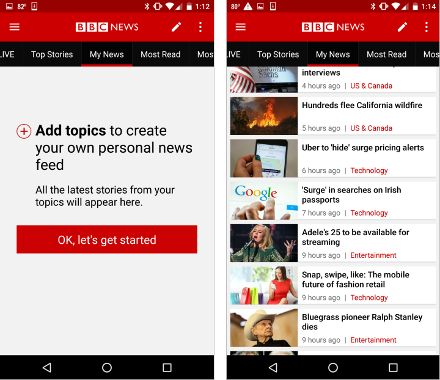
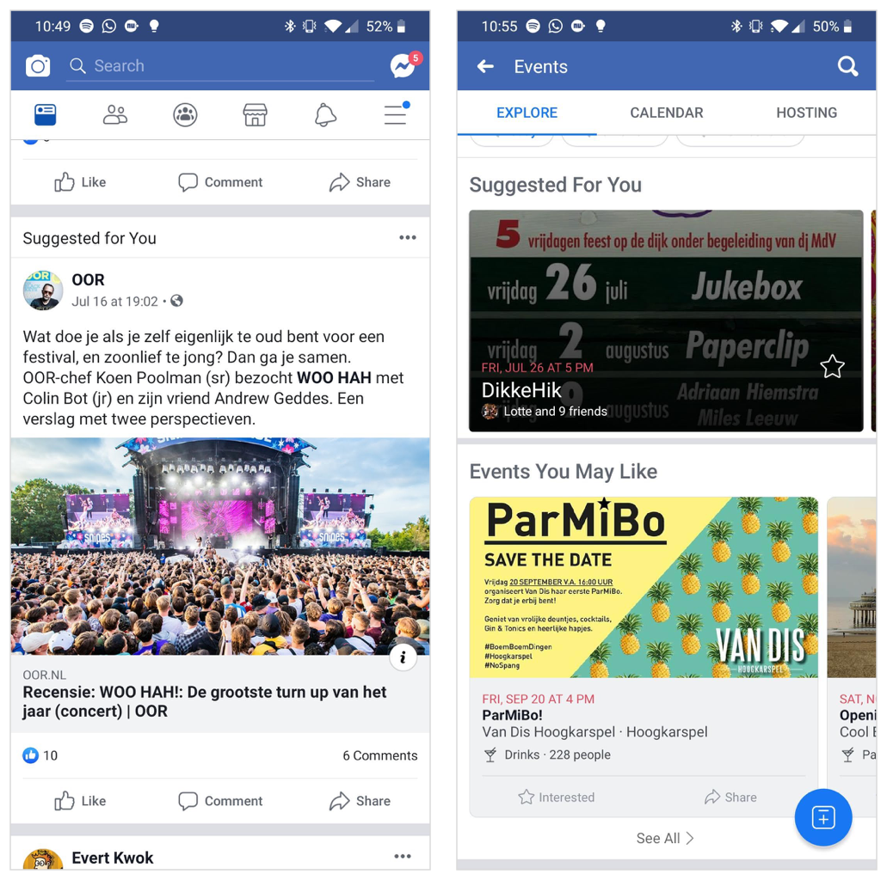

# Customisatie & personalisatie

## Customisatie


**Customisatie:** Controle aan de gebruiker geven over de content.


In het geval van customisatie kan de gebruiker zelf voorkeuren opgeven voor de user experience ****die hij wil hebben. Hierbij kunnen functionaliteiten, content of layout worden aangepast door de gebruiker. Bijvoorbeeld het verschuiven van items in de interface, het selecteren van interesses \(zoals in de afbeelding hierboven\) of het aanpassen van kleuren.

Het voordeel van customisatie is dat de gebruiker precies te zien krijgt wat hij wil, hij is zelf in controle. Het nadeel hiervan is, is dat de gebruiker misschien niet zo goed weet wat hij eigenlijk wil en dat hij zelf de moeite moet nemen om voorkeuren op te geven en instellingen te veranderen. \(Schade, 2016\)

**Meerwaarde voor Klup**  
In de huidige Klup app zit al een vorm van customisatie. Onder het kopje "speciaal voor jou" worden activiteiten getoond waaraan dezelfde interesses gekoppeld zitten als de interesses die de gebruiker heeft geselecteerd in zijn profiel. In de [interviews](de-kluppers/interviews.md) en [berichten die Klup ontvangt](de-kluppers/klachten-van-kluppers.md) geven de gebruikers echter aan dat ze het niet zo ervaren dat de activiteiten die daar staan aansluiten bij hun interesses. Hiervoor moet eerst meer onderzoek gedaan worden naar de interessegebieden van de kluppers en de soort activiteiten die in de app staan zodat die goed op elkaar kunnen worden afgestemd.

## Personalization


**Personalisatie:** Controle aan het systeem geven over de content.


In het geval van personalisatie bepaald het systeem wat voor content er wordt aangeboden, gebaseerd op data die het systeem heeft verzameld van de gebruiker. Dit kan op individueel niveau \(bijvoorbeeld suggesties op basis van zoekgeschiedenis van een gebruiker\) of op groepsniveau \(bijvoorbeeld informatie gebaseerd op een bepaalde beroepsrol, zoals docent\). Een voorbeeld van een app die veel gepersonaliseerde content aanbied is Facebook \(zoals te zien in de afbeelding hierboven\).

Het voordeel van personalisatie is dat de verbeterde user experience geen moeite kost voor de gebruiker, omdat het systeem het werk doet. Het nadeel hiervan is, is dat de computer bepaald wat voor jou relevante content is terwijl dit niet altijd hoeft te kloppen. Daarbij kan het voor sommige gebruikers _creepy_ overkomen dat een computer veel over hen weet.

Designers hebben vaak veel ideeën over de content die aan gebruikers kan worden getoond. Het is verleidelijk om alle opties aan te bieden. Dit moet je echter niet doen, omdat de interface dan te complex wordt. \(Schade, 2016\)

> _It’s the designer’s job to prioritize the ideas and create a tight base-level design that can subsequently be augmented through personalization and customization._ – Amy Schade

**Meerwaarde voor Klup**  
Ik denk dat Klup veel profijt kan hebben van het tonen van gepersonaliseerde content. Juist omdat de gebruikers niet zo thuis zijn in het gebruiken van een app, is het heel waardevol als de app zelf activiteiten laat zien die goed aansluiten bij de gebruiker. Hier komt echter vooral een technisch aspect bij kijken om ervoor te zorgen dat de getoonde activiteiten ook wel echt goed aansluiten.

Er moeten meer eigenschappen worden meegenomen dan alleen de interesses die de gebruiker heeft aangegeven in zijn profiel en de interesses die de organisatoren aan de activiteit koppelen. Waar bijvoorbeeld naar gekeken kan worden is een match op subcategorieen binnen de interesses, of dat de gebruiker in het weekend of doordeweeks naar activiteiten gaat, de afstand die de gebruiker af wil leggen naar een activiteit etc. Deze data moet het systeem verzamelen en koppelen aan de getoonde activiteiten.

