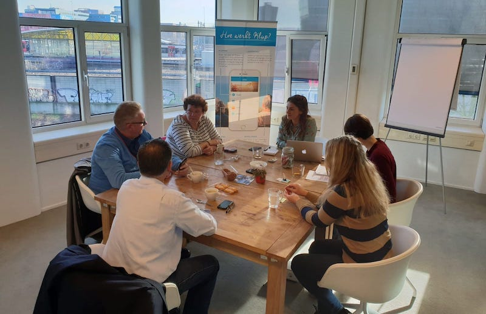

# Focus Group

Op 14 februari heb ik een focus group gehouden met vier kluppers. Deze focus group heb ik samen gedaan met Maudi die ook bij Klup aan het afstuderen is. Zij studeert gerontologie \(leer van het ouder worden\) en houdt zich bezig met de vraag: _Welke factoren beïnvloeden het participeren en organiseren van activiteiten van/door de leden binnen de sociale community Klup?_

Deze focus group is bedoeld als kennismaking met de doelgroep.

## Onderwerpen

* Reden aanmelding Klup
* Ervaring met Klup activiteiten
* Ervaring met de Klup app
* Deelnemen en organiseren

## Resultaten

De resultaten van de focus group kun je vinden in [Google Drive](https://drive.google.com/file/d/1MbcQBJZzT46wbjLMTxsAzUA9DEhnElZI/view?usp=sharing).

## Conclusies

* Nieuwe kluppers vinden het moeilijk om te integreren in de bestaande Klup community. Kluppers die elkaar al langer kennen gaan vaak samen naar activiteiten en hebben hele conversaties met elkaar in de reacties bij een activiteit in de app. Dit zorgt voor een drempel bij de nieuwe kluppers om naar hun eerste activiteit te gaan.
* Veel activiteiten hebben een maximaal aantal deelnemers. Kluppers die elkaar al kennen nodigen elkaar uit voor activiteiten, hierdoor zitten de activiteiten met beperkt aantal deelnemers snel vol met kluppers die elkaar al kennen. Als je wilt weten of iemand zich weer heeft afgemeld, moet je dit zelf gaan controleren in de app.
* Als je een reactie in de app hebt achtergelaten bij een activiteit, dan krijg je daarna elke keer een melding als iemand anders ook reageert of zich aanmeldt. Deze meldingen kun je niet uitzetten en worden als vervelend ervaren.
* Als er een activiteit is op een openbare plek zoals een café, of bij een openbaar evenement met veel mensen, weet je niet wie van de aanwezigen klupper is. De kluppers moeten herkenbaar zijn, maar dit moet wel subtiel zijn \(niet iedereen wil met een een badge met “Klup” rondlopen bijvoorbeeld\). _NB: Dit valt buiten mijn scope, dit is een probleem dat buiten de app om opgelost moet worden._
* Wanneer je je hebt aangemeld voor Klup \(dit kan alleen via de app\), krijg je verder geen uitleg over wat Klup is en hoe het werkt met de activiteiten. Een tutorial of meer uitleg tijdens de onboarding kan hiervoor een oplossing zijn. 

## Toevoegingen aan PvE

De volgende eisen komen voort uit de conclusies en neem ik mee in mijn [programma van eisen](../programma-van-eisen.md).


**Wanneer er een plekje vrij is gekomen bij een volle activiteit, moet de gebruiker hiervan op de hoogte kunnen worden gebracht**



**De applicatie moet de mogelijkheid bieden om meldingen aan en uit te kunnen zetten**



**De applicatie moet bij het eerste gebruik uitleg bieden over wat Klup is en hoe het werkt**


\*\*\*\*

