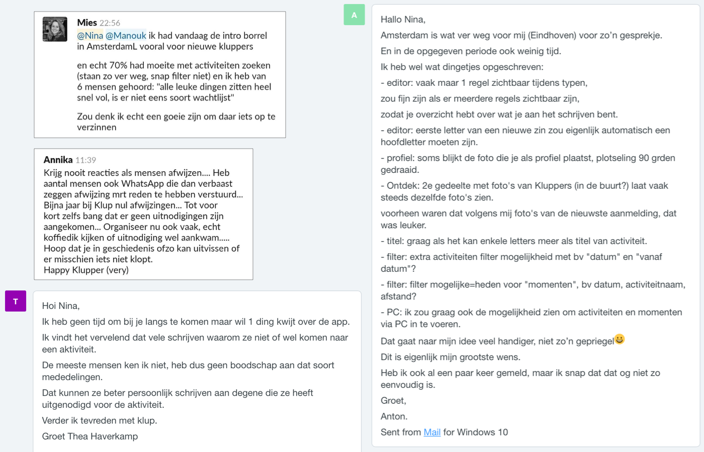

# Berichten van kluppers

Via verschillende kanalen komen er bij Klup vragen en klachten binnen van gebruikers. Vaak zijn dit vragen over de werking van de app en verzoeken tot verbeteringen van de app. Hieronder heb ik een aantal van deze berichten verzameld waarin de meestvoorkomende problemen genoemd worden.

## Conclusies

* Gebruikers moeten lang scrollen door de activiteiten lijst om nieuwe activiteiten te vinden of activiteiten die later in de toekomst plaatsvinden.
* Gebruikers willen graag op datum of dag kunnen zoeken, of bijvoorbeeld activiteiten “in het weekend”.
* Gebruikers willen graag activiteiten kunnen zien en aanmaken op de PC \(via een website\). De app op de telefoon vinden sommige gebruikers “onoverzichtelijk” en “een gepriegel”.
* Het wordt als vervelend ervaren dat sommige gebruikers zich kort van te voren afmelden voor een activiteit.
* Activiteiten onder het kopje “speciaal voor jou” en “aanbevolen” sluiten niet goed aan bij de interesses van de gebruiker, of de activiteiten zitten al vol en zijn dus niet meer relevant.
* Het is niet altijd duidelijk waar een activiteit is, omdat er bijvoorbeeld alleen de straatnaam bij staat in het overzicht.
* Gebruikers willen weten wanneer er een plekje vrij is gekomen bij een volle activiteit.
* Gebruikers willen meerdere interesses kunnen toevoegen aan een activiteit, zodat de kans groter is dat iemand de activiteit vind die die zoekt.
* Nieuwe gebruikers snappen niet hoe ze de activiteiten kunnen filteren
* Gebruikers kunnen nergens terug zien aan wie ze uitnodigingen hebben gestuurd, en ze krijgen geen feedback of de andere gebruiker zich vervolgens aanmeld of niet. Hierdoor ontstaat er twijfel of de uitnodiging wel is aangekomen.

## Toevoegingen aan PvE

De volgende eisen komen voort uit de conclusies en neem ik mee in mijn [programma van eisen](../programma-van-eisen.md).


**De activiteiten moeten gefilterd kunnen worden op datum**



**De activiteiten in het ontdek scherm moeten beter worden afgestemd op de gebruiker**



**Wanneer er een plekje vrij is gekomen bij een volle activiteit, moet de gebruiker hiervan op de hoogte kunnen worden gebracht**



**Een organisator moet meerdere interesses kunnen toewijzen aan een activiteit**



**De applicatie moet ook kunnen werken op een desktop PC**



**De gebruiker moet in de app kunnen zien aan wie ze uitnodigingen voor activiteiten hebben gestuurd**


