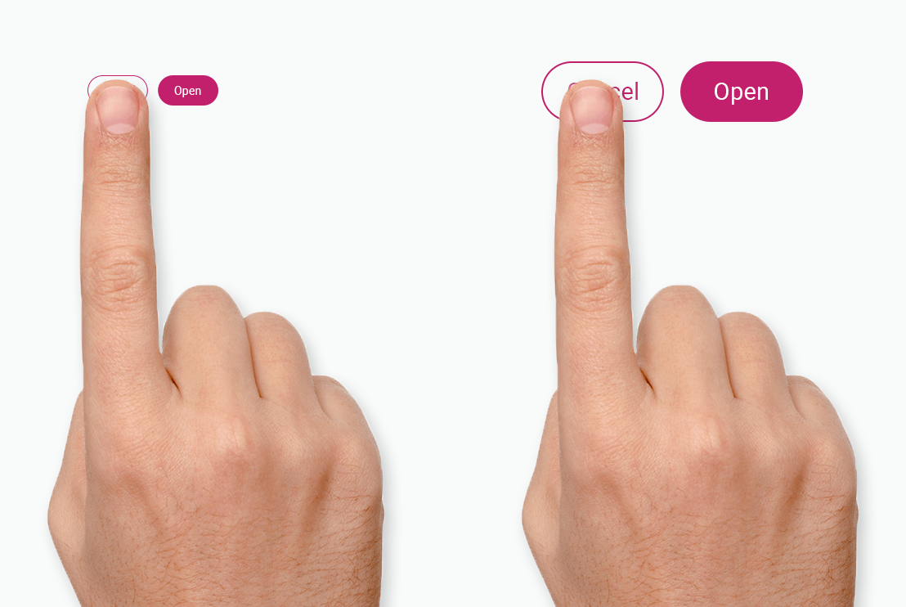
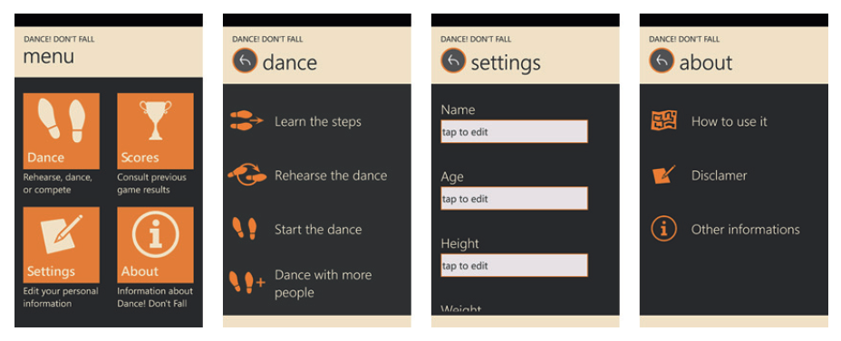
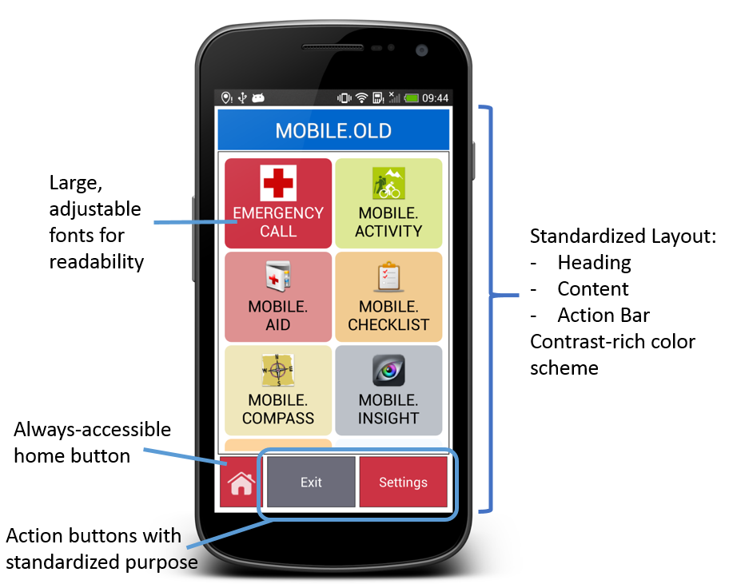
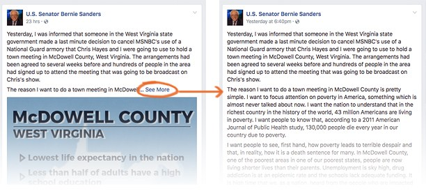

# Een applicatie voor 50-plussers

De gebruikers van Klup zijn allemaal 50 jaar of ouder. Zoals het spreekwoord zegt: ouderdom komt met gebreken. Zicht, moteriek en geheugen gaan naarmate je ouder wordt achteruit. Het is voor oudere mensen daardoor moeilijker om kleine teksten te lezen en kleuren van elkaar te onderscheiden. Dingen aanklikken gaat met minder precisie. Het aanleren van nieuwe concepten zoals bepaalde patterns in een mobiele interface kost meer tijd, en ze hebben meer tijd nodig om een beslissing te maken.

De _working memory_ \(werkgeheugen, tijdelijke opslagplaats in de hersenen van taak-relevante informatie\) __van senioren gaat achteruit waardoor ze meer moeite hebben om te onthouden waar alles staat en snel te veel informatie binnen krijgen waardoor ze last hebben van _information overload_  \(de situatie waarin de vereiste hoeveelheid informatie om een taak te voltooien teveel is om gemakkelijk in het werkgeheugen te worden verwerkt\).

\(Adiseshiah, 2017; Campbell, 2015; Levdikova, 2017; Piernik, 2017; Slavicek, 2014\)

## Digital immigrants

Daarbij komt ook kijken dat de kluppers, die in 1969 \(50 jaar geleden\) of eerder geboren zijn, behoren tot de groep _digital immigrants_. Digital immigrants zijn mensen die voor 1980 geboren en daardoor niet zijn opgegroeid in het digitale tijdperk. Ze verwerken informatie hierdoor minder snel en kunnen minder goed multitasken dan _digital natives_, die geboren zijn na 1980. Voor digital natives gaat het gebruiken van digitale media hen daarom veel makkelijker af dan voor digital immigrants, omdat zij hier van jongs af aan intensief mee bezig zijn. \(Cut, 2017; Yavari, z.d.\)

> _Seniors perceive information differently than younger people. Their cognitive structure is sequential and millennials’ is parallel. This means that when it comes to dealing with technology, **seniors require a step by step approach at a slower pace** while the cognitive structure of millennials enables them to process multiple information at once._ - Mahsa Yavari

## User interface guidelines voor een oudere doelgroep

### **Grote fonts**

Voor teksten geldt: hoe groter hoe beter. Gebruik het liefst minimaal 16 pixels. De leesbaarheid is ook afhankelijk van andere factoren zoals het soort font, de dikte, line height, contrast. Het meest ideale scenario is dat de gebruiker zelf de lettergrootte aan kan passen. Echter is de ruimte op een smartphone scherm beperkt, dus het is een uitdaging om alles in het design goed te laten  passen wanneer de tekst erg groot is. Test altijd met gebruikers of de tekst goed te lezen is \(Adiseshiah, 2017; Campbell, 2015; Boll & Brune, 2015; Polyuk, z.d.\).

Een hoog contrast tussen tekst en achtergrond is erg belangrijk voor de leesbaarheid. Oudere mensen kunnen kleuren minder goed onderscheiden, vooral bij blauw en paars tinten. Daarnaast maken ze meestal gebruik van oudere en goedkopere devices die een minder goed kleurencontrast hebben dan high-end devices \(Adiseshiah, 2017; Boll & Brune, 2015; Campbell, 2015;  Slavicek, 2014\).

Om er zeker van te zijn dat de gebruikers de teksten goed kunnen lezen, houd ik mij aan de minimum eisen van het [WCAG \(Web Content Accessibility Guidelines\)](https://www.w3.org/WAI/WCAG21/Understanding/contrast-minimum.html) voor contrast ratio.


De [WCAG \(Web Content Accessibility Guidelines\)](https://www.w3.org/WAI/WCAG21/Understanding/contrast-minimum.html) schrijft voor dat de **contrast ratio** minimaal 4.5:1 moet zijn bij tekst, en minimaal 3:1 bij grote tekst \(18 pt of 14pt bold\).  
  
_“The intent of this Success Criterion is to provide enough contrast between text and its background so that it can be read by people with moderately low vision \(who do not use contrast-enhancing assistive technology\).”_


### Iconen & tekst

Iconen worden veel gebruikt in mobiele apps. Voor oudere gebruikers is de betekenis van verschillende iconen echter veel minder vanzelfsprekend. Uit een onderzoek dat Atomic Object in 2014 heeft gehouden, bleek dat 58% van de senioren veelvoorkomende iconen niet kon herkennen. Het beste kun je iconen altijd gebruiken in combinatie met tekst. Dit vergroot de herkenbaarheid van de knop en gebruikers weten zeker wat de knop doet. \(de Barros, 2014; McClung, 2014; Levdikova, 2017; Polyuk, z.d.; Slavicek, 2014\)

### **Grote touch target & spacing**

Knoppen en andere klikbare items moeten groot genoeg zijn zodat ze makkelijk aan te klikken zijn. Guidelines van Google an Apple houden respectievelijk 9 en 9,6 mm aan in diagonaal, maar voor een oudere doelgroep kun je beter voor iets groter gaan. Ook moet er minimaal 2 mm ruimte zitten tussen klikbare elementen. Ook in dit geval geldt: test met de gebruikers of het goed werkt. \(Adiseshiah, 2017; Campbell, 2015; de Barros, 2014\).

### **Simpele & consisitente navigatie**

De navigatiestructuur moet voor een oudere doelgroep zo simpel mogelijk zijn. De _working memory_ van senioren gaat achteruit, waardoor ze minder snel nieuwe concepten leren en moeite hebben om te onthouden waar dingen staan. Ze hebben meer moeite met het ontwikkelen van een mental model van de organisatie en hierarchie in een interface. Het is daarom heel belangrijk dat de navigatie in de gehele applicatie consistent is en niet te veel lagen heeft. \(Adiseshiah, 2017; de Barros, 2014; Boll, 2015\)

> _User interfaces were estimated as helpful when the menu structure is consistent throughout the application and has not too many layers \(“I do not want to click twenty times to get to the information I am looking for”, “it is important to be able to click through a homepage without getting lost”\)._ – Friederike Boll

Uit verschillende onderzoeken is gebleken dat oudere mensen behoefte hebben aan een startpagina waar alle top-level menu items terug te vinden zijn. Dit helpt ze bij het begrijpen van de informatie structuur. De startpagina dient daarnaast als een "safe point" om naar terug te gaan wanneer ze even niet weten waar ze heen moeten in de app. Het aanbieden van een duidelijke terug knop helpt hierbij. Wanneer de gebruiker gedesorienteerd is, kan hij op deze manier altijd weer teruggaan naar het startscherm. \(de Barros, 2014; Birn, 2014\)

> _Participants seemed to use the back button when disoriented. Therefore, test results lead us to believe that the back button is important as a fall-back mechanism that older adults rely on when they do not know how to solve a given problem._ – Ana Correia de Barros

### Minimaliseer cognitive load

Wanneer een gebruiker meerdere taken moet uitvoeren en hierbij moet onthouden wat zijn vorige actie was, laat alles dan op één scherm zien. Bij langere taken die uit veel verschillende deeltaken bestaan, is het zinvol om de deeltaken te verspreiden over meerdere schermen zodat de gebruiker geen _cognitive overload_ krijgt. Zorg er bij langere taken wel voor dat je de progressie weergeeft en de gebruiker helpt herinneren aan het einddoel. \(Campbell, 2015; Polyuk, z.d.\)


**Cognitive overload:** the situation when the required amount of information to complete a task is too much to be processed easily in working memory. \(Malgorzata Piernik, 2017\)


_Progressive disclosure_ is een goede manier om cognitive overload tegen te gaan. Bij progressive disclosure laat je alleen hetgene zien wat op dat moment relevant is, met de mogelijkheid om meer details te laten zien wanneer de gebruiker dat wil.


**Progressive disclosure:** The user wants to focus on the task at hand with as few distractions as possible while still being able to dig deeper in details if necessary  \(UI-patterns, 2019\)


Daarnaast zijn push notificaties een ontzettend handige en zinvolle manier om de gebruiker op het juiste moment iets te laten weten. Bijvoorbeeld wanneer je de volgende dag een activiteit gepland hebt staan, of wanneer er een nieuwe activiteit bij je in de buurt is toegevoegd. Dit zorgt er tevens voor dat de gebruiker getriggerd wordt om de app te openen. \(Campbell, 2015; Levdikova, 2017\)

### Begijpelijke taal

De titels van bijvoorbeeld knoppen moeten begrijpelijk zijn voor de doelgroep. Vermijdt jargon en zorg er voor dat de benamingen passen binnen de gebruikte context. In het geval van bijvoorbeeld een datum, is "morgen" of "gisteren" duidelijker dan een numerieke datum. \(de Barros, 2014; Slavicek, 2014\)

> _Technology companies make the mistake of assuming that everyone has the same mental model, or that people implicitly know technological jargon and symbols. The strategy is akin to “I know you don’t understand what I’m saying so I’m going to shout it louder at you”. If you increase the font of a word that’s is unfamiliar, it doesn’t help you understand what it means any better._ – K4Connect

## Toevoegingen aan PvE

De volgende eisen komen voort uit dit onderzoek en neem ik mee in mijn [programma van eisen](programma-van-eisen.md).


**De tekst moet groot genoeg zijn om makkelijk te worden gelezen door de gebruikers**



**Het contrast tussen de tekst en de achtergrond moet voldoen aan de eisen van de WCAG \(contrast ratio minimaal 4.5:1\)**



**Gebruik klikbare iconen altijd in combinatie met een tekst label**



**De touch target van de knoppen moet groot genoeg zijn zodat de gebruikers niet mis klikken**



**De navigatiestructuur moet simpel en consistent zijn**



**De applicatie moet een startpagina hebben waarin de top-level items van het menu te vinden zijn**



**Er moet een duidelijke terugknop zijn waarmee de gebruiker terug kan gaan naar de startpagina van de app**



**De benamingen moeten aansluiten bij de vocabulaire van de oudere doelgroep**


