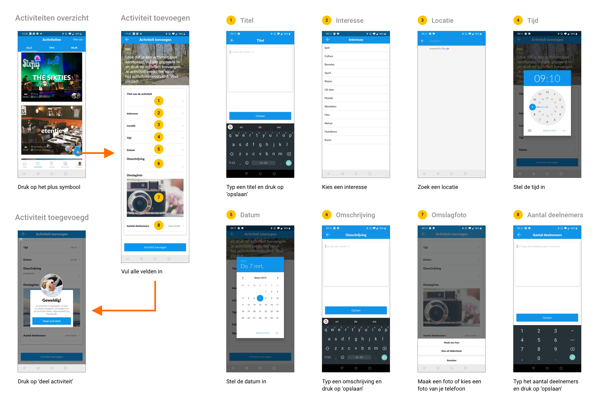

# Activiteit toevoegen

Het toevoegen van een activiteit doe je door in het activiteiten overzicht op het plus-symbool rechts-onderin te klikken \(de floating action button\).

De gebruiker moet acht verschillende velden invullen. Voor de titel, omschrijving en het aantal deelnemers moet je niet vergeten om op “opslaan” te klikken, anders wordt de informatie niet opgeslagen. Dit zou eenvoudiger gemaakt kunnen worden door meteen te kunnen typen, in plaats van dat er een nieuw scherm wordt geopend.

Wanneer je per ongeluk het scherm afsluit door op het terug pijltje te klikken, ben je alle reeds ingevulde informatie kwijt en moet je weer opnieuw beginnen. Het zou gebruiksvriendelijker zijn wanneer je eerst een waarschuwing krijgt, of dat de app automatisch de informatie opslaat.

Als je nog niet alles hebt ingevuld en je klikt op “activiteit toevoegen”, dan geeft de app een melding waarin staat wat je nog moet invullen. Echter klopt dit bericht niet altijd, dan heb je bijvoorbeeld geen tijd ingevuld en dan staat er “voeg aub een datum toe” \(bug\).

Als je wel alles hebt ingevuld en je klikt op “activiteit toevoegen”, dan komt er een pop-up in beeld met de tekst: “Geweldig! Je activiteit is geplaatst. Je kan nu andere kluppers uitnodigen en de activiteit delen. Bijvoorbeeld op Facebook!”. De enige actie die je kunt kiezen is “deel activiteit”. Wanneer je hier op klikt, crasht de app \(bug\).

