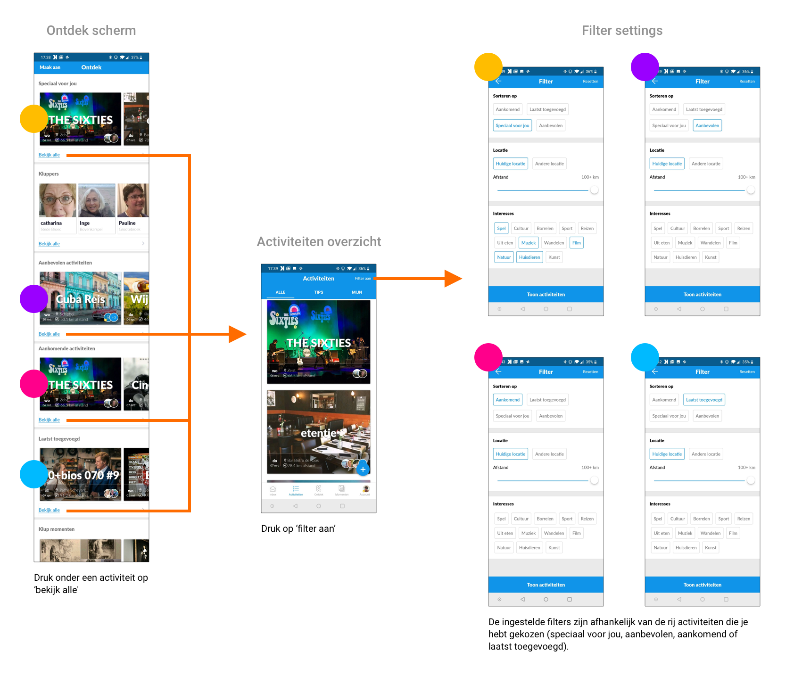

# Activiteiten zoeken

Het zoeken naar activiteiten kan op twee verschillende manieren: via het ontdekscherm of meteen via het activiteiten overzicht.

Op het ontdek scherm staan verschillende rijen content waar je horizontaal doorheen kunt scrollen: vier soorten activiteiten \(speciaal voor jou, aanbevolen, aankomend en laatst toegevoegd\), kluppers en laatste nieuws \(blogs\).

Wanneer de gebruiker op “bekijk alle” klikt onder de corresponderende rij activiteiten, gaat hij naar het activiteitenoverzicht. Afhankelijk van de gekozen rij, worden er bepaalde filters ingesteld \(in de wire flow aangegeven met de gekleurde bolletjes\) 

Deze filters overschrijven de filters die je daarvoor had ingesteld in het activiteiten overzicht. Dus wanneer je bijvoorbeeld altijd binnen 25 km binnen je woonplaats zoekt, dan is dit nu opeens ingesteld op onbeperkte afstand. Dit is heel verwarrend voor de gebruiker, omdat je niet door hebt dat er andere filters zijn ingesteld.

