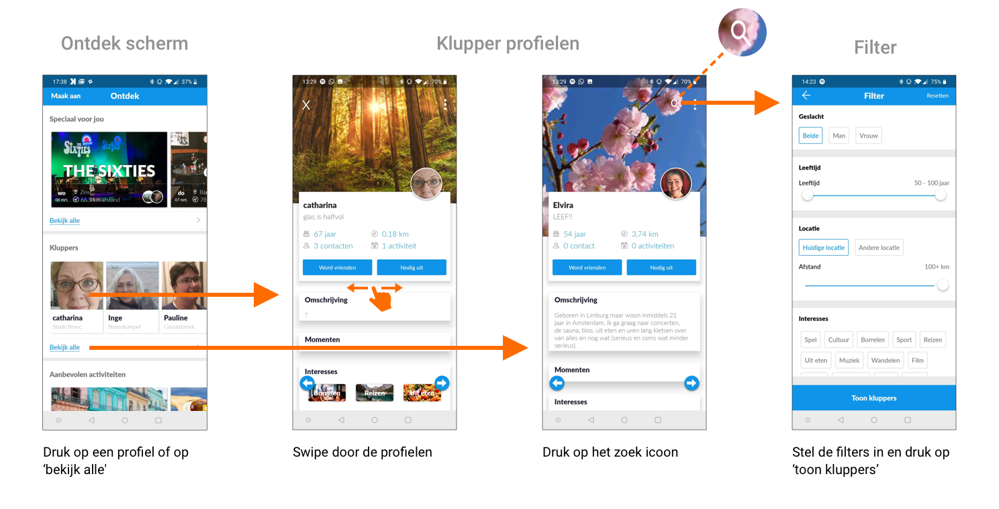

# Kluppers zoeken

Wanneer de gebruiker andere kluppers wil zoeken, moet hij eerst naar het ontdek scherm. De kluppers die daar te zien zijn, zijn de kluppers die zich het dichtst bij de huidige locatie van de gebruiker bevinden.

Als je op een profielfoto in het ontdek scherm klikt, ga je naar het profiel van die klupper. Vervolgens kun je andere profielen bekijken door naar links of rechts te swipen of op de pijltjes onderin te klikken.

Wanneer je op “Bekijk alle” klikt, lijkt het alsof je weer gewoon naar een klupper profiel gaat, maar er is één verschil: nu staat er rechtsboven een vergrootglas waar je de resultaten kunt filteren.

Veel gebruikers weten niet dat je op die manier gerichter kunt zoeken naar kluppers, het vergrootglas wordt snel over het hoofd gezien. Ook zie je niet welke filters er aan staan, en of dat er überhaubt filters ingesteld zijn \(bij activiteiten staat er “filter aan”, hier zie je niks\).

