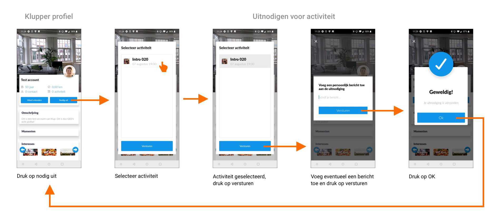

# Kluppers uitnodigen

Je kunt andere kluppers uitnodigen voor activiteiten. Dit kan op twee manieren:

**Bevriende kluppers uitnodigen**

De gebruiker kan bevriende kluppers uitnodigen voor een activiteit door bij een activiteit op “uitnodigen” te klikken. Je hoeft hiervoor niet aangemeld te zijn voor de activiteit. Er verschijnt vervolgens een pop-up met een lijst van je Klup contacten. Je kunt meerdere contacten selecteren en dan op “bevestig” klikken.

Je zou verwachten dat je dan klaar bent, maar dan verschijnt er nog een pop-up waarin je een persoonlijk bericht kunt toevoegen. Je hoeft hier niks in te vullen maar er staat niet bij dat het optioneel is. Wanneer je wel begint te typen zie je maximaal één regel van je ingetypte tekst, wat heel irritant is.

Als je vervolgens op “versturen” klikt, verschijnt er nog een laatste pop-up waarin staat: “Gefeliciteerd! Uitnodiging is verstuurd.” Deze pop-up wordt niet op alle telefoons helemaal goed weergegeven, dit is een bug.

**Andere kluppers uitnodigen**

De gebruiker kan andere kluppers uitnodigen voor een activiteit waar hij zelf heen gaat. Dit doe je door naar een profiel van een andere klupper te gaan en op "Nodig uit" te klikken. Er verschijnt vervolgens een pop-up met een lijst van jde activiteiten waar je heen gaat. Je kunt één activiteit selecteren en dan op “versturen” klikken.

Ook in dit geval verschijnt er weer een pop-up waarin je een bericht toe kan voegen. Ook dit is optioneel en weer zie je maar één regel van je ingevoerde tekst.

Wat opvalt als je de twee flows zo onder elkaar ziet, is dat het vrijwel dezelfde flows zijn alleen qua design zijn ze beide net even anders. De ene pop-up gebruikt vinkjes bij het selecteren en de andere gebruikt een grijs vlak. Ook de pop-up voor het invoeren van het bericht ziet er net even anders uit, en ook bijvoorbeeld de OK button. Dit soort inconsistenties vind je in de hele app terug en maakt het geheel erg rommelig.

Je kunt je verstuurde uitnodigingen nergens terug vinden, en je kunt meerdere uitnodigingen voor dezelfde activiteit sturen naar dezelfde klupper. Deze klupper ontvangt de uitnodigingen ook allemaal. Dit zou voorkomen moeten worden.

