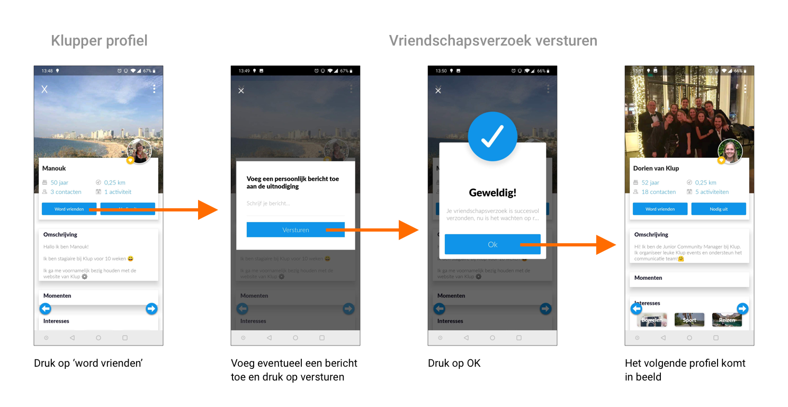

# Vriendschapsverzoek sturen

Wanneer je het profiel van een andere klupper bekijkt, kun je een vriendschapsverzoek sturen door op de knop “Word vrienden” te klikken. Er verschijnt dan een pop-up waarin je een persoonlijk bericht mee kunt sturen. Je hoeft hier niks in te vullen maar er staat niet bij dat het optioneel is. Wanneer je wel begint te typen zie je maximaal één regel tekst, dus dat is irritant.

Als je op “versturen” hebt geklikt verschijnt er nog een pop-up met een bevestiging dat je vriendschapsverzoek is verstuurd. De tekst wordt afgekapt omdat de tweede regel er niet op past, terwijl er net zo goed nog een regel onder had kunnen staan.

Wanneer je deze pop-up sluit, komt het profiel van de volgende klupper in beeld. Je kunt je verzonden vriendschapsverzoek niet ergens terugvinden in de app.

